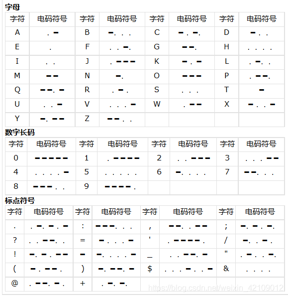

## Crypto

#### MD5

- `题目.txt`：e00cf25ad42683b3df678c61f42c6bda
- 根据提示，这是经过MD5加密的字符串，所以进行解密，即得flag。

#### Url编码

- `题目.txt`：%66%6c%61%67%7b%61%6e%64%20%31%3d%31%7d

- 根据提示，这是经过url编码的字符串，所以进行解码，即得flag。

  ```python
  from urllib import parse
  
  strings = parse.unquote('%66%6c%61%67%7b%61%6e%64%20%31%3d%31%7d') #解码字符串
  print(strings)  
  
  flag{and 1=1}
  ```

#### 一眼就解密

- 根据提示：下面的字符串解密后便能获得flag：ZmxhZ3tUSEVfRkxBR19PRl9USElTX1NUUklOR30=

- 给的字符串是经过base64加密的，解密即得flag。

  ```python
  import base64
  
  s = 'ZmxhZ3tUSEVfRkxBR19PRl9USElTX1NUUklOR30='
  
  print(base64.b64decode(s))
  ```

#### 看我回旋踢

- `题目.txt`：synt{5pq1004q-86n5-46q8-o720-oro5on0417r1}

- 这看起来像是flag经过了凯撒密码加密，尝试进行解密。

- flag的标准格式是：`flag{........}`，故`f`加密为`s`，经过了13的移位。

  ```python
  # -*- coding: utf-8 -*-
  class CaesarCipher(object):
      """
      凯撒加密解密
      """
  
      def __crypt(self, char, key):
          """
          对单个字母加密，偏移
          @param char: {str} 单个字符
          @param key: {num} 偏移量
          @return: {str} 加密后的字符
          """
          if not char.isalpha():
              return char
          else:
              base = "A" if char.isupper() else "a"
              return chr((ord(char) - ord(base) + key) % 26 + ord(base))
  
      def encrypt(self, char, key):
          """
          对字符加密
          """
          return self.__crypt(char, key)
  
      def decrypt(self, char, key):
          """
          对字符解密
          """
          return self.__crypt(char, -key)
  
      def __crypt_text(self, func, text, key):
          """
         对文本加密
         @param char: {str} 文本
         @param key: {num} 偏移量
         @return: {str} 加密后的文本
         """
          lines = []
          for line in text.split("\n"):
              words = []
              for word in line.split(" "):
                  chars = []
                  for char in word:
                      chars.append(func(char, key))
                  words.append("".join(chars))
              lines.append(" ".join(words))
          return "\n".join(lines)
  
      def encrypt_text(self, text, key):
          """
          对文本加密
          """
          return self.__crypt_text(self.encrypt, text, key)
  
      def decrypt_text(self, text, key):
          """
          对文本解密
          """
          return self.__crypt_text(self.decrypt, text, key)
  
  
  if __name__ == '__main__':
      key = 13
      cipher = CaesarCipher()
      
      # 解密
      print(cipher.decrypt_text("synt{5pq1004q-86n5-46q8-o720-oro5on0417r1}", key))
  ```

#### 摩丝

- `题目.txt`：.. .-.. --- ...- . -.-- --- ..-

- 根据提示，这是经过摩斯密码加密的flag，解密即得flag。

- 摩斯密码表：

  

#### [BJDCTF 2nd]签到-y1ng

- 根据提示：给定字符串签到：QkpEe1czbGMwbWVfVDBfQkpEQ1RGfQ==

- 给的字符串是经过base64加密的，解密即得flag。

  ```python
  import base64
  
  s = 'QkpEe1czbGMwbWVfVDBfQkpEQ1RGfQ=='
  
  print(base64.b64decode(s))
  ```

#### password

- 题目：

  

- 除了这三行没有其他信息。简单组合「姓名首字母+生日」即得flag。

#### 变异凯撒

- 加密密文：afZ_r9VYfScOeO_UL^RWUc

- 根据提示，此题应该是凯撒密码的加强版。下表是前四位的加密信息，根据这个规则，继续解密。

  | 原文 | 密文 | 平移(ASCII) |
  | :--: | :--: | :---------: |
  |  f   |  a   |     -5      |
  |  l   |  f   |     -6      |
  |  a   |  Z   |     -7      |
  |  g   |  _   |     -8      |

- 在「看我回旋踢」的基础上修改加密方式，解密后即得flag。

  ```python
  # -*- coding: utf-8 -*-
  class CaesarCipher(object):
      """
      凯撒加密解密
      """
  
      def __crypt(self, char, key):
          """
          对单个字母加密，偏移
          @param char: {str} 单个字符
          @param key: {num} 偏移量
          @return: {str} 加密后的字符
          """
          return chr(ord(char) + key)
  
      def encrypt(self, char, key):
          """
          对字符加密
          """
          return self.__crypt(char, -key)
  
      def decrypt(self, char, key):
          """
          对字符解密
          """
          return self.__crypt(char, key)
  
      def __crypt_text(self, func, text, key):
          """
         对文本加密
         @param char: {str} 文本
         @param key: {num} 偏移量
         @return: {str} 加密后的文本
         """
          lines = []
          for line in text.split("\n"):
              words = []
              for word in line.split(" "):
                  chars = []
                  for char in word:
                      chars.append(func(char, key))
                      key += 1
                  words.append("".join(chars))
              lines.append(" ".join(words))
          return "\n".join(lines)
  
      def encrypt_text(self, text, key):
          """
          对文本加密
          """
          return self.__crypt_text(self.encrypt, text, key)
  
      def decrypt_text(self, text, key):
          """
          对文本解密
          """
          return self.__crypt_text(self.decrypt, text, key)
  
  
  if __name__ == '__main__':
      key = 5
  
      cipher = CaesarCipher()
  
      # 解密
      print(cipher.decrypt_text("afZ_r9VYfScOeO_UL^RWUc", key))
  ```

#### Quoted-printable

- `题目.txt`：=E9=82=A3=E4=BD=A0=E4=B9=9F=E5=BE=88=E6=A3=92=E5=93=A6
- 根据提示，这是「可打印字符引用编码」，[解码](http://web.chacuo.net/charsetquotedprintable)即得flag。

#### Rabbit

- `题目.txt`：U2FsdGVkX1/+ydnDPowGbjjJXhZxm2MP2AgI
- 根据提示，这是「Rabbit」加密，解密即得flag。

#### 篱笆墙的影子

- `题目.txt`：felhaagv{ewtehtehfilnakgw}

- 根据提示，这是「栅栏密码」。

  ```
  flag{wethinkw
  ehavetheflag}
  ```

- 两行合并即得flag。

####RSA

- `题目.txt`：

  

- 解密：

  
  $$
  p = 473398607161，q = 4511491 \\
  n = p \times q = 2135733555619387051 \\
  φ(n) = (p-1)\times(q-1) = 2135733082216268400 \\
  e = 17 \\
  C ＝ M^e \ mod\ n \\
  M ＝C^d \ mod \ n \\
  e \times d \ mod \ φ(n) = 1
  $$

  ```python
  import gmpy2
  
  def Decrypt(c,e,p,q):
  	L=(p-1)*(q-1)
  	d=gmpy2.invert(e,L)
  	n=p*q
  	m=gmpy2.powmod(c,d,n)
  	flag=str(d)
  	print("flag{"+flag+"}")
  
  if __name__ == '__main__':
  	p=473398607161
  	q=4511491
  	e=17
  	c=55
  	Decrypt(c,e,p,q)
  ```

####丢失的MD5

- Python2直接运行.py脚本，即得flag。（python3需要修改为以下）

  ```python
  import hashlib   
  for i in range(32,127):
      for j in range(32,127):
          for k in range(32,127):
              m=hashlib.md5()
              m.update(('TASC'+chr(i)+'O3RJMV'+chr(j)+'WDJKX'+chr(k)+'ZM').encode('utf-8'))
              des=m.hexdigest()
              if 'e9032' in des and 'da' in des and '911513' in des:
                  print(des)
  ```

#### [BJDCTF 2nd]老文盲了 

- 题目：罼雧締眔擴灝淛匶襫黼瀬鎶軄鶛驕鳓哵眔鞹鰝
- 可以将这些生僻字转化成拼音，或者直接使用工具朗读，即得flag。

#### Alice与Bob

- 将98554799767分解成101999和966233两个素数。

- 根据提示：分解后，小的放前面，大的放后面，合成一个新的数字，进行md5的32位小写哈希。即得flag。

  ```python
  import hashlib
  
  print(hashlib.md5('101999966233'.encode('utf - 8')).hexdigest())
  
  d450209323a847c8d01c6be47c81811a
  ```

#### rsarsa

- 参考「RSA」，求明文，即得flag。

  ```
  import gmpy2
  
  def Decrypt(c,e,p,q):
  	L=(p-1)*(q-1)
  	d=gmpy2.invert(e,L)
  	n=p*q
  	m=gmpy2.powmod(c,d,n)
  	flag=str(m)
  	print("flag{"+flag+"}")
  
  if __name__ == '__main__':
  	p =
  9648423029010515676590551740010426534945737639235739800643989352039852507298491399561035009163427050370107570733633350911691280297777160200625281665378483
  	q = 11874843837980297032092405848653656852760910154543380907650040190704283358909208578251063047732443992230647903887510065547947313543299303261986053486569407
  	e=65537
  	c = 83208298995174604174773590298203639360540024871256126892889661345742403314929861939100492666605647316646576486526217457006376842280869728581726746401583705899941768214138742259689334840735633553053887641847651173776251820293087212885670180367406807406765923638973161375817392737747832762751690104423869019034
  	Decrypt(c,e,p,q)
  ```

#### 大帝的密码武器

- 根据提示：一种以罗马三巨头之一的人的名字命名的加密方式。

- 查找罗马三巨头：凯撒、庞培、克拉苏。

- 我们学过的只有「凯撒密码」。加密后的字符串：`FRPHEVGL`。从key=2开始，分别计算到key=25，解密，看哪个字符串是有意义的。

  ```python
  # -*- coding: utf-8 -*-
  class CaesarCipher(object):
      """
      凯撒加密解密
      """
  
      def __crypt(self, char, key):
          """
          对单个字母加密，偏移
          @param char: {str} 单个字符
          @param key: {num} 偏移量
          @return: {str} 加密后的字符
          """
          if not char.isalpha():
              return char
          else:
              base = "A" if char.isupper() else "a"
              return chr((ord(char) - ord(base) + key) % 26 + ord(base))
  
      def encrypt(self, char, key):
          """
          对字符加密
          """
          return self.__crypt(char, key)
  
      def decrypt(self, char, key):
          """
          对字符解密
          """
          return self.__crypt(char, -key)
  
      def __crypt_text(self, func, text, key):
          """
         对文本加密
         @param char: {str} 文本
         @param key: {num} 偏移量
         @return: {str} 加密后的文本
         """
          lines = []
          for line in text.split("\n"):
              words = []
              for word in line.split(" "):
                  chars = []
                  for char in word:
                      chars.append(func(char, key))
                  words.append("".join(chars))
              lines.append(" ".join(words))
          return "\n".join(lines)
  
      def encrypt_text(self, text, key):
          """
          对文本加密
          """
          return self.__crypt_text(self.encrypt, text, key)
  
      def decrypt_text(self, text, key):
          """
          对文本解密
          """
          return self.__crypt_text(self.decrypt, text, key)
  
  
  if __name__ == '__main__':
      for key in range(2,26):
          cipher = CaesarCipher()
          # 解密
          print(cipher.decrypt_text("FRPHEVGL".lower(), key))
          print(key)
  ```

- 当key=13时，解密出的字符串有意义且是`SECURITY`。

- 对`ComeChina`解密即得flag。

#### Windows系统密码

- 查看题目：

  ```bash
  cat pass.hash 
  Administrator:500:aad3b435b51404eeaad3b435b51404ee:31d6cfe0d16ae931b73c59d7e0c089c0:::
  ctf:1002:06af9108f2e1fecf144e2e8adef09efd:a7fcb22a88038f35a8f39d503e7f0062:::
  Guest:501:aad3b435b51404eeaad3b435b51404ee:31d6cfe0d16ae931b73c59d7e0c089c0:::
  SUPPORT_388945a0:1001:aad3b435b51404eeaad3b435b51404ee:bef14eee40dffbc345eeb3f58e2
  ```

- 将所有`:`后面的长字符串都去进行MD5解密，有结果的就是flag。
- ctf后面的`a7fcb22a88038f35a8f39d503e7f006`进行md5解密后是`good-luck`。即为flag。

#### [GKCTF2020]小学生的密码学

- 根据提示，加密方式为：`e(x)=11x+6(mod26)`，密文为`welcylk`

- 逆向解密得到明文字符串：`kgjuwjq`

- base64加密后即得flag。

  ```python
  import gmpy2
  import string
  import base64
  
  m = gmpy2.invert(11,26)   ## (11*m) = 1 mod 26
  
  table = string.ascii_lowercase
  print(table)
  secrt = "welcylk"
  plain = ''
  for i in secrt:
      x = table.index(i)
      j = (x-6)*m%26
      print(j)
      plain += table[j]
  print(plain)
  # sorcery
  print(base64.b64encode(b'sorcery'))
  # b'c29yY2VyeQ=='
  ```

  

