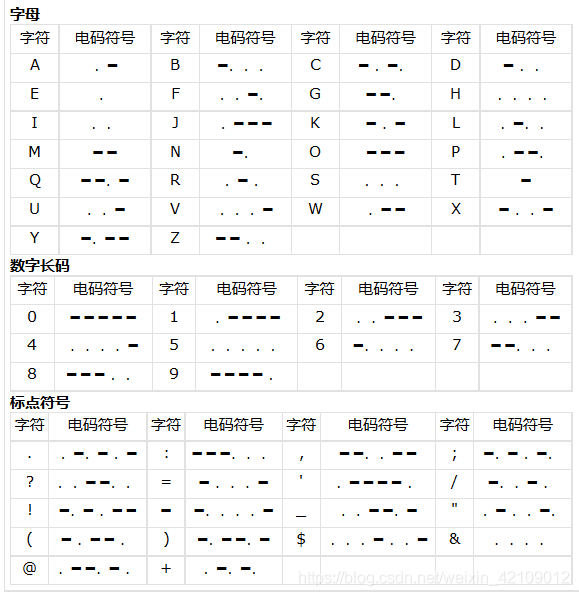
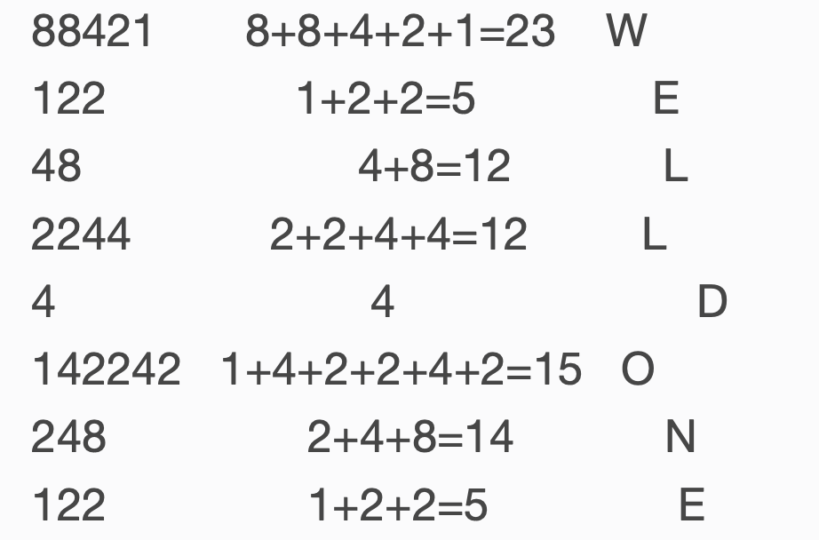
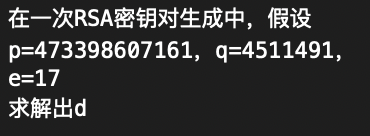

### Crypto新手练习区

#### Base64

- 打开附件，有一个字符串：`Y3liZXJwZWFjZXtXZWxjb21lX3RvX25ld19Xb3JsZCF9`

- 根据题目提示是base64编码，解码即得flag。

  ```python
  import base64
  base64.b64decode('Y3liZXJwZWFjZXtXZWxjb21lX3RvX25ld19Xb3JsZCF9')
  
  cyberpeace{Welcome_to_new_World!}
  ```

#### Caesar

- 打开附件，有一个字符串：`oknqdbqmoq{kag_tmhq_xqmdzqp_omqemd_qzodkbfuaz}`

- 根据题目提示是凯撒密码，解密即得flag。（上一题的flag格式是：`cyberpeace{........}`，故`c`加密为`o`，经过了12的移位。）

  ```python
  # -*- coding: utf-8 -*-
  class CaesarCipher(object):
      """
      凯撒加密解密
      """
  
      def __crypt(self, char, key):
          """
          对单个字母加密，偏移
          @param char: {str} 单个字符
          @param key: {num} 偏移量
          @return: {str} 加密后的字符
          """
          if not char.isalpha():
              return char
          else:
              base = "A" if char.isupper() else "a"
              return chr((ord(char) - ord(base) + key) % 26 + ord(base))
  
      def encrypt(self, char, key):
          """
          对字符加密
          """
          return self.__crypt(char, key)
  
      def decrypt(self, char, key):
          """
          对字符解密
          """
          return self.__crypt(char, -key)
  
      def __crypt_text(self, func, text, key):
          """
         对文本加密
         @param char: {str} 文本
         @param key: {num} 偏移量
         @return: {str} 加密后的文本
         """
          lines = []
          for line in text.split("\n"):
              words = []
              for word in line.split(" "):
                  chars = []
                  for char in word:
                      chars.append(func(char, key))
                  words.append("".join(chars))
              lines.append(" ".join(words))
          return "\n".join(lines)
  
      def encrypt_text(self, text, key):
          """
          对文本加密
          """
          return self.__crypt_text(self.encrypt, text, key)
  
      def decrypt_text(self, text, key):
          """
          对文本解密
          """
          return self.__crypt_text(self.decrypt, text, key)
  
  
  if __name__ == '__main__':
      key = 12
      cipher = CaesarCipher()
      
      # 解密
    print(cipher.decrypt_text("oknqdbqmoq{kag_tmhq_xqmdzqp_omqemd_qzodkbfuaz}", key))
  ```

#### Morse

- 打开附件，有一个字符串：`11 111 010 000 0 1010 111 100 0 / 00 000 000 111 00 10 1 0/ 010 0 000 1 00 10 110`

- 根据题目提示是摩丝密码（0是. 1是-），解密即得flag。`morsecodeissointeresting`

  

#### 幂数加密

- 打开附件，有一个字符串：`8842101220480224404014224202480122`

- 根据题目提示，这是幂数加密，flag是八位大写字母。

- 参考已有Wp，这是影之密码，1,2,4,8四个数字，以加法可以表示出0~9任何一个数字，再用1~26表示A~Z，其中0表示间隔。也被称为“01248密码”

  

  ```python
  a="8842101220480224404014224202480122"
  a=a.split("0")
  flag=''
  for i in range(0,len(a)):
       str = a[i]
       list=[]
       sum=0
       for j in str:
          list.append(j)
          length = len(list)
       for k in range(0,length):
          sum+=int(list[k])
       flag+=chr(sum+64)
  
  ```

#### Railfence

- 打开附件，有一个字符串：`ccehgyaefnpeoobe{lcirg}epriec_ora_g`

- 根据题目提示，这是栅栏密码，并且*在栅栏里面喂5只小鸡*，说明是五行的栅栏。

  ```python
  s = "ccehgyaefnpeoobe{lcirg}epriec_ora_g"
  li = ['','','','','']
  for i in range(len(s)):
      li[i%5] += s[i]
  print(''.join(li))
  
  cyperrocae{gireeol}eahfocec_gnbip_g
  ```

- 使用上述传统方式栅栏解密，得不出正确的flag。查看Wp，使用W型栅栏。直接使用[工具](http://www.atoolbox.net/Tool.php?Id=777)解密得flag。

#### 不仅仅是Morse

- 打开附件，有一个字符串：`--/.-/-.--/..--.-/-..././..--.-/..../.-/...-/./..--.-/.-/-./---/-/...././.-./..--.-/-.././-.-./---/-.././..../..../..../..../.-/.-/.-/.-/.-/-.../.-/.-/-.../-.../-.../.-/.-/-.../-.../.-/.-/.-/.-/.-/.-/.-/.-/-.../.-/.-/-.../.-/-.../.-/.-/.-/.-/.-/.-/.-/-.../-.../.-/-.../.-/.-/.-/-.../-.../.-/.-/.-/-.../-.../.-/.-/-.../.-/.-/.-/.-/-.../.-/-.../.-/.-/-.../.-/.-/.-/-.../-.../.-/-.../.-/.-/.-/-.../.-/.-/.-/-.../.-/.-/-.../.-/-.../-.../.-/.-/-.../-.../-.../.-/-.../.-/.-/.-/-.../.-/-.../.-/-.../-.../.-/.-/.-/-.../-.../.-/-.../.-/.-/.-/-.../.-/.-/-.../.-/.-/-.../.-/.-/.-/.-/-.../-.../.-/-.../-.../.-/.-/-.../-.../.-/.-/-.../.-/.-/-.../.-/.-/.-/-.../.-/.-/-.../.-/.-/-.../.-/.-/-.../.-/-.../.-/.-/-.../-.../.-/-.../.-/.-/.-/.-/-.../-.../.-/-.../.-/.-/-.../-.../.-`

- 根据题目提示，这是摩斯密码，先解密：

  ```
  maybehaveanotherdecodehhhhaaaaabaabbbaabbaaaaaaaabaababaaaaaaabbabaaabbaaabbaabaaaababaabaaabbabaaabaaabaababbaabbbabaaabababbaaabbabaaabaabaabaaaabbabbaabbaabaabaaabaabaabaababaabbabaaaabbabaabba
  ```

- 然后发现后面有一串AB，这是培根密码，直接使用[工具](http://rumkin.com/tools/cipher/baconian.php)解密，即得flag。

#### 混合编码

- 打开附件，有一个字符串：`JiM3NjsmIzEyMjsmIzY5OyYjMTIwOyYjNzk7JiM4MzsmIzU2OyYjMTIwOyYjNzc7JiM2ODsmIzY5OyYjMTE4OyYjNzc7JiM4NDsmIzY1OyYjNTI7JiM3NjsmIzEyMjsmIzEwNzsmIzUzOyYjNzY7JiMxMjI7JiM2OTsmIzEyMDsmIzc3OyYjODM7JiM1NjsmIzEyMDsmIzc3OyYjNjg7JiMxMDc7JiMxMTg7JiM3NzsmIzg0OyYjNjU7JiMxMjA7JiM3NjsmIzEyMjsmIzY5OyYjMTIwOyYjNzg7JiMxMDU7JiM1NjsmIzEyMDsmIzc3OyYjODQ7JiM2OTsmIzExODsmIzc5OyYjODQ7JiM5OTsmIzExODsmIzc3OyYjODQ7JiM2OTsmIzUwOyYjNzY7JiMxMjI7JiM2OTsmIzEyMDsmIzc4OyYjMTA1OyYjNTY7JiM1MzsmIzc4OyYjMTIxOyYjNTY7JiM1MzsmIzc5OyYjODM7JiM1NjsmIzEyMDsmIzc3OyYjNjg7JiM5OTsmIzExODsmIzc5OyYjODQ7JiM5OTsmIzExODsmIzc3OyYjODQ7JiM2OTsmIzExOTsmIzc2OyYjMTIyOyYjNjk7JiMxMTk7JiM3NzsmIzY3OyYjNTY7JiMxMjA7JiM3NzsmIzY4OyYjNjU7JiMxMTg7JiM3NzsmIzg0OyYjNjU7JiMxMjA7JiM3NjsmIzEyMjsmIzY5OyYjMTE5OyYjNzc7JiMxMDU7JiM1NjsmIzEyMDsmIzc3OyYjNjg7JiM2OTsmIzExODsmIzc3OyYjODQ7JiM2OTsmIzExOTsmIzc2OyYjMTIyOyYjMTA3OyYjNTM7JiM3NjsmIzEyMjsmIzY5OyYjMTE5OyYjNzc7JiM4MzsmIzU2OyYjMTIwOyYjNzc7JiM4NDsmIzEwNzsmIzExODsmIzc3OyYjODQ7JiM2OTsmIzEyMDsmIzc2OyYjMTIyOyYjNjk7JiMxMjA7JiM3ODsmIzY3OyYjNTY7JiMxMjA7JiM3NzsmIzY4OyYjMTAzOyYjMTE4OyYjNzc7JiM4NDsmIzY1OyYjMTE5Ow==`

- 根据题目提示是混合编码，依次解码。

- Base64解码：

  ```python
  import base64
  base64.b64decode("....")
  &#76;&#122;&#69;&#120;&#79;&#83;&#56;&#120;&#77;&#68;&#69;&#118;&#77;&#84;&#65;&#52;&#76;&#122;&#107;&#53;&#76;&#122;&#69;&#120;&#77;&#83;&#56;&#120;&#77;&#68;&#107;&#118;&#77;&#84;&#65;&#120;&#76;&#122;&#69;&#120;&#78;&#105;&#56;&#120;&#77;&#84;&#69;&#118;&#79;&#84;&#99;&#118;&#77;&#84;&#69;&#50;&#76;&#122;&#69;&#120;&#78;&#105;&#56;&#53;&#78;&#121;&#56;&#53;&#79;&#83;&#56;&#120;&#77;&#68;&#99;&#118;&#79;&#84;&#99;&#118;&#77;&#84;&#69;&#119;&#76;&#122;&#69;&#119;&#77;&#67;&#56;&#120;&#77;&#68;&#65;&#118;&#77;&#84;&#65;&#120;&#76;&#122;&#69;&#119;&#77;&#105;&#56;&#120;&#77;&#68;&#69;&#118;&#77;&#84;&#69;&#119;&#76;&#122;&#107;&#53;&#76;&#122;&#69;&#119;&#77;&#83;&#56;&#120;&#77;&#84;&#107;&#118;&#77;&#84;&#69;&#120;&#76;&#122;&#69;&#120;&#78;&#67;&#56;&#120;&#77;&#68;&#103;&#118;&#77;&#84;&#65;&#119;
  ```

- [Unicode解码](https://tool.chinaz.com/tools/unicode.aspx)：

  ```
  LzExOS8xMDEvMTA4Lzk5LzExMS8xMDkvMTAxLzExNi8xMTEvOTcvMTE2LzExNi85Ny85OS8xMDcvOTcvMTEwLzEwMC8xMDAvMTAxLzEwMi8xMDEvMTEwLzk5LzEwMS8xMTkvMTExLzExNC8xMDgvMTAw
  ```

- Base64解码：

  ```
  /119/101/108/99/111/109/101/116/111/97/116/116/97/99/107/97/110/100/100/101/102/101/110/99/101/119/111/114/108/100
  ```

- ASCII解码：

  ```python
  data = "/119/101/108/99/111/109/101/116/111/97/116/116/97/99/107/97/110/100/100/101/102/101/110/99/101/119/111/114/108/100"
  s = data.split('/')
  flag = ''
  for i in range(1,len(s)):
      flag += chr(int(s[i]))
  print(flag)
  
  welcometoattackanddefenceworld
  ```

#### easy_RSA

- 打开附件：

  

- 解密：
  $$
  p = 473398607161，q = 4511491 \\
  n = p \times q = 2135733555619387051 \\
  φ(n) = (p-1)\times(q-1) = 2135733082216268400 \\
  e = 17 \\
  C ＝ M^e \ mod\ n \\
  M ＝C^d \ mod \ n \\
  e \times d \ mod \ φ(n) = 1
  $$

  ```python
  import gmpy2
  
  def Decrypt(c,e,p,q):
  	L=(p-1)*(q-1)
  	d=gmpy2.invert(e,L)
  	n=p*q
  	m=gmpy2.powmod(c,d,n)
  	flag=str(d)
  	print("flag{"+flag+"}")
  
  if __name__ == '__main__':
  	p=473398607161
  	q=4511491
  	e=17
  	c=55
  	Decrypt(c,e,p,q)
  ```

#### easychallenge

- 打开附件，是一个`.pyc`文件，先搜一搜这是个什么文件：pyc文件就是 Python程序编译后得到的字节码文件 (py->pyc).

- 查看Wp，使用工具[uncompyle2](https://github.com/wibiti/uncompyle2)进行pyc反编译。

  

