## MISC

#### 签到

- 将「签到题」后的`flag{buu_ctf}`复制提交即可。

#### 金三胖

- 观察gif图，发现他会闪现红底黑字，猜测是flag。

- 使用macbook预览打开，观察每一帧，可以拼出flag。

  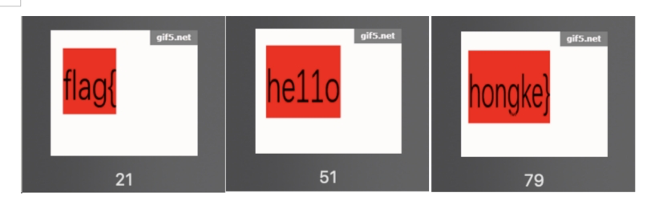

#### 二维码

- 先用微信扫一扫：serect is here。

- 在linux下打开这个`QR_code.png`，发现里面有一个`4number.txt`。

  ```bash
  00000000: 8950 4e47 0d0a 1a0a 0000 000d 4948 4452  .PNG........IHDR
  00000010: 0000 0118 0000 0118 0103 0000 00bd 407b  ..............@{
  00000020: cf00 0000 0650 4c54 45ff ffff 0000 0055  .....PLTE......U
  00000030: c2d3 7e00 0001 8c49 4441 5468 81ed 993b  ..~....IDATh...;
  00000040: 9283 3010 44e5 5240 c811 7c14 8e06 47db  ..0.D.R@..|...G.
  00000050: a370 0442 020a 6dcf 4702 ca1b 1959 dea0  .p.B..m.G....Y..
  00000060: bb8a b235 bc49 3c9a 8fe4 10a8 361a 92eb  ...5.I<.....6...
  00000070: a7c3 d3e3 cb2c e62e 9b57 3275 98c5 7e6f  .....,...W2u..~o
  00000080: 65d2 12dd dced 667e 9269 c93c 60de c084  e.....f~.i.<`...
  00000090: 079e 2c30 23ec 64ea 331a 8b80 572b 998f  ..,0#.d.3...W+..
  000000a0: 32d8 e6fd 866d 8e57 64be c358 2258 bca0  2....m.Wd..X"X..
  000000b0: 098c 3988 c8d4 6292 4bcc 03ea fc04 7371  ..9...b.K.....sq
  000000c0: 78e9 cb64 de64 aec2 9e1f 6709 cccb 1b32  x..d.d....g....2
  000000d0: 6d18 37e7 9e2b 0367 f0aa 54e2 45e6 26d3  m.7..+.g..T.E.&.
  000000e0: a3d2 3cb7 e023 fc66 5e92 2d53 4fa6 2da3  ..<..#.f^.-SO.-.
  000000f0: ab10 93c5 ea38 5bed b620 5389 099a 0198  .....8[.. S.....
  00000100: 62b4 29e8 9c29 b38d 58b1 3007 32f7 9921  b.)..)..X.0.2..!
  00000110: c914 938f a5b9 ce8b ce7b 9e4c 0bc6 1411  .........{.L....
  00000120: af55 7a01 e039 0f9c a7bc 2073 97b1 793e  .Uz..9.... s..y>
  00000130: 9e3c 6484 1787 292f c854 60a4 9aeb 6a28  .<d...)/.T`...j(
  00000140: 9191 58ac 567f c8b4 64a4 fe58 c951 73d4  ..X.V...d..X.Qs.
  00000150: 9e6b 8981 0599 5acc 21bd 7bdf b4e7 eaa0  .k....Z.!.{.....
  00000160: 332e e152 e7c9 7c9a 1992 4bcf 56da 733b  3..R..|...K.V.s;
  00000170: bb5c 5098 4c2d a6dc 8fe9 47d4 62e4 b188  .\P.L-....G.b...
  00000180: 642a 32e5 3f8e 70dc 8f99 fcb0 4aa6 39e3  d*2.?.p.....J.9.
  00000190: 7705 9617 d7b3 1599 8a4c ae3f b9fc 8fc7  w........L.?....
  000001a0: 6c43 a602 6396 7227 3385 3ce8 9cf6 3c99  lC..c.r'3.<...<.
  000001b0: 268c d79a 13a3 09b2 ff3d db90 7993 a1fe  &........=..y...
  000001c0: 8b7e 01b2 1b8d d5e6 6967 8600 0000 0049  .~......ig.....I
  000001d0: 454e 44ae 4260 8250 4b03 0414 0009 0008  END.B`.PK.......
  000001e0: 008b 502f 4846 344c ae1d 0000 000f 0000  ..P/HF4L........
  000001f0: 000b 0000 0034 6e75 6d62 6572 2e74 7874  .....4number.txt
  00000200: 6e0d da0b 3f5a 177a 310d 516a 7875 c603  n...?Z.z1.Qjxu..
  00000210: 4a9d 97a9 b75b fcea 01cb 7fa5 4f50 4b07  J....[......OPK.
  00000220: 0846 344c ae1d 0000 000f 0000 0050 4b01  .F4L.........PK.
  00000230: 021f 0014 0009 0008 008b 502f 4846 344c  ..........P/HF4L
  00000240: ae1d 0000 000f 0000 000b 0024 0000 0000  ...........$....
  00000250: 0000 0020 0000 0000 0000 0034 6e75 6d62  ... .......4numb
  00000260: 6572 2e74 7874 0a00 2000 0000 0000 0100  er.txt.. .......
  00000270: 1800 8065 270e 394f d101 657a 6864 f34c  ...e'.9O..ezhd.L
  00000280: d101 657a 6864 f34c d101 504b 0506 0000  ..ezhd.L..PK....
  00000290: 0000 0100 0100 5d00 0000 5600 0000 0000  ......]...V.....
  ```

- 看已有的write_up，使用「binwalk」分析图片。

  ```bash
  binwalk QR_code.png 
  
  DECIMAL       HEXADECIMAL     DESCRIPTION
  --------------------------------------------------------------------------------
  0             0x0             PNG image, 280 x 280, 1-bit colormap, non-interlaced
  471           0x1D7           Zip archive data, encrypted at least v2.0 to extract, compressed size: 29, uncompressed size: 15, name: 4number.txt
  650           0x28A           End of Zip archive, footer length: 22
  ```

- 发现图片中有一个压缩文件。使用`binwalk -e QR_code.png`，提取zip压缩文件。提取出来`1D7.zip ` 和`4number.txt`两个文件。

- 解压`1D7.zip`，发现需要密码才可以解压。

- 上一步提取的`4number.txt`提示密码是4位，所以使用暴力破解解压密码：`fcrackzip -b -c1 -l 4 -u 1D7.zip`。（其中，-b 暴力破解模式 -c 指定掩码类型（a=a-z;1=0-9;!=特殊字符） -l 密码长度 -u 压缩文件名）

  

- 再次解压，输入密码，成功解压出txt文件，打开即得flag。

#### N种方法解决

- 下载下来的文件是`KEY.exe`

- 在kali下`file KEY.exe` 查看文件类型。发现是一个文本文件。

  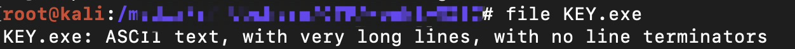

- 直接`cat KEY.exe`，发现是一个base64编码的jpg图片。

  ```bash
  data:image/jpg;base64,iVBORw0KGgoAAAANSUhEUgAAAIUAAACFCAYAAAB12js8AAAAAXNSR0IArs4c6QAAAARnQU1BAACxjwv8YQUAAAAJcEhZcwAADsMAAA7DAcdvqGQAAArZSURBVHhe7ZKBitxIFgTv/396Tx564G1UouicKg19hwPCDcrMJ9m7/7n45zfdxe5Z3sJ7prHbf9rXO3P4lLvYPctbeM80dvtP+3pnDp9yF7tneQvvmcZu/2lf78zhU+5i9yxv4T3T2O0/7eu68OT2H3LCft0l/ae9ZlTo+23pPvX7/rwJHbfcsI+3aW9Z33m1Gj7Len+9bs+PIndt5ywT3dp71mfOTXafku6f/2uD09i9y0n7NNd2nvWZ06Ntt+S7l+/68MJc5O0OSWpcyexnFjfcsI+JW1ukpRfv+vDCXOTtDklqXMnsZxY33LCPiVtbpKUX7/rwwlzk7Q5JalzJ7GcWN9ywj4lbW6SlF+/68MJc5O0OSWpcyexnFjfcsI+JW1ukpRfv+vDCXOTWE7a/i72PstJ2zfsHnOTpPz6XR9OmJvEctL2d7H3WU7avmH3mJsk5dfv+nDC3CSWk7a/i73PctL2DbvH3CQpv37XhxPmJrGctP1d7H2Wk7Zv2D3mJkn59bs+nDA3ieWEfdNImylJnelp7H6bmyTl1+/6cMLcJJYT9k0jbaYkdaansfttbpKUX7/rwwlzk1hO2DeNtJmS1Jmexu63uUlSfv2uDyfMTWI5Yd800mZKUmd6Grvf5iZJ+fW7PjzJ7v12b33LSdtvsfuW75LuX7/rw5Ps3m/31rectP0Wu2/5Lun+9bs+PMnu/XZvfctJ22+x+5bvku5fv+vDk+zeb/fWt5y0/Ra7b/ku6f71+++HT0v+5l3+tK935vApyd+8y5/29c4cPiX5m3f5077emcOnJH/zLn/ar3d+/flBpI+cMDeNtJkSywn79BP5uK+yfzTmppE2U2I5YZ9+Ih/3VfaPxtw00mZKLCfs00/k477K/tGYm0baTInlhH36iSxflT78TpI605bdPbF7lhvct54mvWOaWJ6m4Z0kdaYtu3ti9yw3uG89TXrHNLE8TcM7SepMW3b3xO5ZbnDfepr0jmlieZqGd5LUmbbs7onds9zgvvU06R3TxPXcSxPrW07YpyR1pqTNKUmdKUmdk5LUaXzdWB/eYX3LCfuUpM6UtDklqTMlqXNSkjqNrxvrwzusbzlhn5LUmZI2pyR1piR1TkpSp/F1Y314h/UtJ+xTkjpT0uaUpM6UpM5JSeo0ft34+vOGNLqDfUosN7inhvUtJ+ybRtpMd0n39Goa3cE+JZYb3FPD+pYT9k0jbaa7pHt6NY3uYJ8Syw3uqWF9ywn7ppE2013SPb2aRnewT4nlBvfUsL7lhH3TSJvpLunecjWV7mCftqQbjSR1puR03tqSbkx/wrJqj7JPW9KNRpI6U3I6b21JN6Y/YVm1R9mnLelGI0mdKTmdt7akG9OfsKzao+zTlnSjkaTOlJzOW1vSjelPWFbp8NRImylJnWnL7r6F7zN3STcb32FppUNTI22mJHWmLbv7Fr7P3CXdbHyHpZUOTY20mZLUmbbs7lv4PnOXdLPxHZZWOjQ10mZKUmfasrtv4fvMXdLNxndYWunQlFhutHv2W42n+4bds7wl3VuuskSJ5Ua7Z7/VeLpv2D3LW9K95SpLlFhutHv2W42n+4bds7wl3VuuskSJ5Ua7Z7/VeLpv2D3LW9K97avp6GQ334X3KWlz+tukb5j+hO2/hX3Ebr4L71PS5vS3Sd8w/Qnbfwv7iN18F96npM3pb5O+YfoTtv8W9hG7+S68T0mb098mfcP0Jxz/W+x+FPethvUtN2y/m7fwnvm1+frzIOklDdy3Gta33LD9bt7Ce+bX5uvPg6SXNHDfaljfcsP2u3kL75lfm68/D5Je0sB9q2F9yw3b7+YtvGd+bb7+vCEN7ySpMzXSZrqL3bOcsN9Kns4T2uJRk6TO1Eib6S52z3LCfit5Ok9oi0dNkjpTI22mu9g9ywn7reTpPKEtHjVJ6kyNtJnuYvcsJ+y3kqfzxNLiEUosJ+xTYvkudt9yg3tqpM2d5Cf50mKJEssJ+5RYvovdt9zgnhppcyf5Sb60WKLEcsI+JZbvYvctN7inRtrcSX6SLy2WKLGcsE+J5bvYfcsN7qmRNneSn+RLK5UmbW4Sywn7lOzmhH3a0u7ZN99hadmRNjeJ5YR9SnZzwj5taffsm++wtOxIm5vEcsI+Jbs5YZ+2tHv2zXdYWnakzU1iOWGfkt2csE9b2j375jtcvTz+tuX0vrXF9sxNkjrTT+T6rvyx37ac3re22J65SVJn+olc35U/9tuW0/vWFtszN0nqTD+R67vyx37bcnrf2mJ75iZJneknUn+V/aWYUyNtpqTNqZE2UyNtGlvSjTsT9VvtKHNqpM2UtDk10mZqpE1jS7pxZ6J+qx1lTo20mZI2p0baTI20aWxJN+5M1G+1o8ypkTZT0ubUSJupkTaNLenGnYnl6TujO2zP3DTSZkp2c8L+0xppM32HpfWTIxPbMzeNtJmS3Zyw/7RG2kzfYWn95MjE9sxNI22mZDcn7D+tkTbTd1haPzkysT1z00ibKdnNCftPa6TN9B2uXh5/S9rcbEk37jR2+5SkzpSkzo4kdaavTg6/JW1utqQbdxq7fUpSZ0pSZ0eSOtNXJ4ffkjY3W9KNO43dPiWpMyWpsyNJnemrk8NvSZubLenGncZun5LUmZLU2ZGkzvTVWR/e0faJ7Xdzw/bMKbGc7PbNE1x3uqNtn9h+Nzdsz5wSy8lu3zzBdac72vaJ7Xdzw/bMKbGc7PbNE1x3uqNtn9h+Nzdsz5wSy8lu3zzBcsVewpyS1LmTWG7Y3nLCPm1JN05KLP/D8tRGzClJnTuJ5YbtLSfs05Z046TE8j8sT23EnJLUuZNYbtjecsI+bUk3Tkos/8Py1EbMKUmdO4nlhu0tJ+zTlnTjpMTyP/R/i8PwI//fJZYb3Jvv8Pd/il+WWG5wb77D3/8pflliucG9+Q5//6f4ZYnlBvfmO1y9PH7KFttbfhq+zySpMyVtbr7D1cvjp2yxveWn4ftMkjpT0ubmO1y9PH7KFttbfhq+zySpMyVtbr7D1cvjp2yxveWn4ftMkjpT0ubmO1y9ftRg9y0n7FPD+paTtk9O71sT13Mv7WD3LSfsU8P6lpO2T07vWxPXcy/tYPctJ+xTw/qWk7ZPTu9bE9dzL+1g9y0n7FPD+paTtk9O71sT1/P7EnOTWG5wb5LUmRptn3D/6b6+eX04YW4Syw3uTZI6U6PtE+4/3dc3rw8nzE1iucG9SVJnarR9wv2n+/rm9eGEuUksN7g3SepMjbZPuP90X9+8PpwwN0mb72pYfzcn1rf8NHwffXXWhxPmJmnzXQ3r7+bE+pafhu+jr876cMLcJG2+q2H93ZxY3/LT8H301VkfTpibpM13Nay/mxPrW34avo++OuvDCXOT7OZGu7e+5YT9XYnlhH36DlfvfsTcJLu50e6tbzlhf1diOWGfvsPVux8xN8lubrR761tO2N+VWE7Yp+9w9e5HzE2ymxvt3vqWE/Z3JZYT9uk7XL1+1GD3LX8avt8klhu2t5yc6F+/68OT2H3Ln4bvN4nlhu0tJyf61+/68CR23/Kn4ftNYrlhe8vJif71uz48id23/Gn4fpNYbtjecnKif/3+++HTnub0fd4zieUtvLfrO1y9PH7K05y+z3smsbyF93Z9h6uXx095mtP3ec8klrfw3q7vcPXy+ClPc/o+75nE8hbe2/Udzv9X+sv/OP/881/SqtvcdpBh+wAAAABJRU5ErkJggg==
  ```

- 方法一：

  - 使用python进行base64解码。

    ```python
    import base64
    data = "iVBORw0KGgoAAAA.....AAAABJRU5ErkJggg=="
    base64.b64decode(data)
    inf = base64.b64decode(s)
    with open ("abc",'wb') as f:
    	 f.write(inf)
    ```

  - `file abc` 查看文件类型，发现是一个png图片数据。

    

  - 直接打开`abc`，是一个二维码，用手机扫一扫即得flag。

- 方法二：

  - 直接将`KEY.exe`编辑为一个html文件打开。

    ```html
    
    ```

  - 保存为`KEY.exe.html`，直接在浏览器中打开，就是一张二维码图片，用手机扫一扫即得flag。

#### 大白

- 下载下来的`dabai.png`不能正常打开。

  

- 执行`vi -b dabai.png`，以二进制打开编辑图片，在执行`:%!xxd`转16进制。

  ```
  00000000: 8950 4e47 0d0a 1a0a 0000 000d 4948 4452  .PNG........IHDR
  00000010: 0000 02a7 0000 0100 0806 0000 006d 7c71  .............m|q
  00000020: 3500 0000 0173 5247 4200 aece 1ce9 0000  5....sRGB.......
  00000030: 0004 6741 4d41 0000 b18f 0bfc 6105 0000  ..gAMA......a...
  ```

- 其中

  - 8950 4E47 是文件的格式png
  - 0000 000d 说明IHDR头块长为13
  - 4948 4452 IHDR标识
  - 0000 02a7 图像的宽
  - 0000 0100 图像的高

  - 6d 7c 71 35 CRC校验和

- 参考已有的Write_up，写脚本计算正确的图片高度。

  ```python
  import os
  import binascii
  import struct
  
  
  misc = open("dabai.png","rb").read()
  
  for i in range(1024):
      data = misc[12:20] +struct.pack('>i',i)+ misc[24:29]
      crc32 = binascii.crc32(data) & 0xffffffff
      if crc32 == 0x6d7c7135:
          print i
  ```

- 得到高度i为479，转16进制为01DF。修改0000 0100为0000 01DF，保存。
- 图片正常打开，即得flag。

#### zip伪加密

-  解压`.zip`文件，发现需要密码。

- 先以关键字「CTF zip 伪加密」搜索，找到zip伪加密的原理（[CTF——MISC——zip伪加密总结](https://blog.csdn.net/vhkjhwbs/article/details/99851686)）

  - zip伪加密是在**文件头的加密标志位做修改**，进而再打开文件时识被别为加密压缩包。
  - 把 **压缩源文件目录区** 的 **全局方式位标记**  的 01 00 或 09 00 改为 00 00  就可以**去除**密码。

- 在mac下使用「Hex Fiend」打开下载的`.zip`文件。

  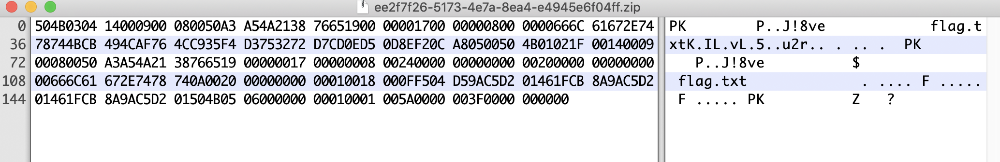

- 压缩源文件数据区：
  - **50 4B 03 04：这是头文件标记（0x04034b50）** 
  - **14 00：解压文件所需 pkware 版本** 
  - **09 00：全局方式位标记（有加密，00 00表示无加密）**

- 将**09 00**改为**00 00**。
-  再次解压，无需密码即可成功解压。解压出`flag.txt`，获得flag。

#### LSB

- 由题目：此题的flag应该是用LSB算法隐写在图片中。

- 先将图片转化为灰度图，再将RGB通道分离。生成三通道的灰度图：`Blue.jpg`，`Red.jpg`，`Green.jpg`。

  ```python
  import cv2
  import matplotlib.pyplot as plt
  
  img = cv2.imread('flag11.png')
  
  # 灰度图
  img0 = cv2.cvtColor(img, cv2.COLOR_RGB2GRAY)
  
  cv2.namedWindow('figure1', 0)
  cv2.resizeWindow('figure1', 960, 480)
  cv2.imshow('figure1', img0)
  
  for col in ['Blue', "Green", 'Red']:
      cv2.namedWindow(col, 0)
      cv2.resizeWindow(col, 960, 480)
  b, g, r = cv2.split(img)
  
  cv2.imwrite('Blue.jpg', b)
  cv2.imwrite('Red.jpg', r)
  cv2.imwrite('Green.jpg', g)
  cv2.destroyAllWindows()
  ```

- 因为LSB是将原本10进制的像素转为8位2进制，将8位2进制的最后一位置0或者置1来隐写数据，所以要枚举所有像素，当该位像素最后一位不为0时，置为255的黑点。方法可以让像素值和0000 0001进行与运算。通过运算，如果隐写值为0则整个像素置0（白），如果隐写值为1则整个像素置为255（黑）。

  ```python
  # coding:utf-8
  
  from PIL import Image
  img = Image.open('Blue.jpg') # Green.jpg && Red.jpg
  width,height=img.size
  for i in range(0,width):
      for j in range(0,height):
          tmp = img.getpixel((i,j))
          if tmp&0x1 == 0:
              img.putpixel((i,j),0)
          else:
              img.putpixel((i,j),255)
  img.save('Bluelsb.jpg')
  ```

  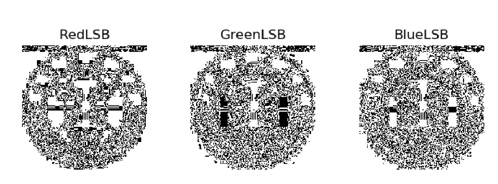

- 发现这三张图上部分都有一些冗余，是隐写进来的图片信息。
- 将数据提取出来并合并，是一张二维码，扫一扫即得flag。

#### ningen

- 使用「binwalk」分析图片。发现图片中藏着一个压缩包。

  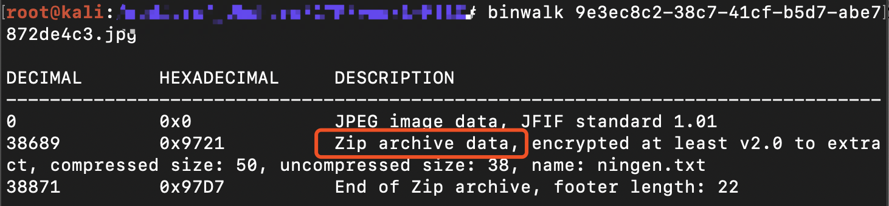

- 使用`binwalk -e`，提取zip压缩文件。提取出来`9721.zip ` 和`ningen.txt`两个文件。

- 解压`9721.zip`，发现需要密码才可以解压。

- 使用暴力破解解压密码：`fcrackzip -b -c1 -l 4 -u 1D7.zip`。（其中，-b 暴力破解模式 -c 指定掩码类型（a=a-z;1=0-9;!=特殊字符） -l 密码长度 -u 压缩文件名）

   

- 再次解压，输入密码，成功解压出txt文件，打开即得flag。

#### 被嗅探的流量

- 先使用「binwalk」对文件进行分析。发现里面藏着一个JPEG图片。

  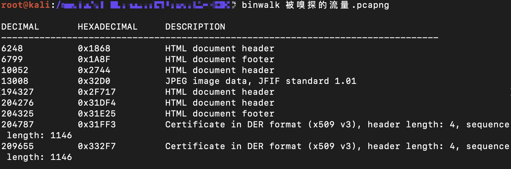

- 使用wireshark对pcap包进行分析。

  - 在过滤器中输入http，过滤出http包。可以看出上传了一个JPEG图片。

    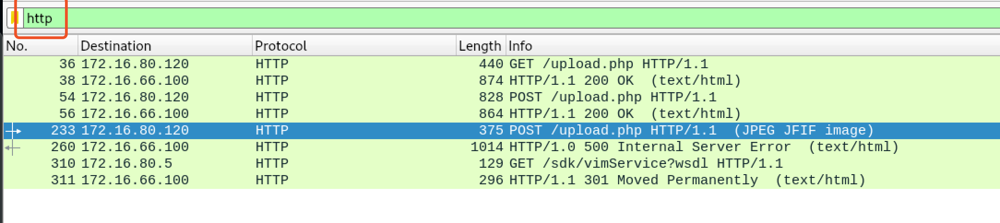

- 右键数据包——>追踪流——>Http流。可以看到上传图片的内容，下滑查找，即可看到flag。

  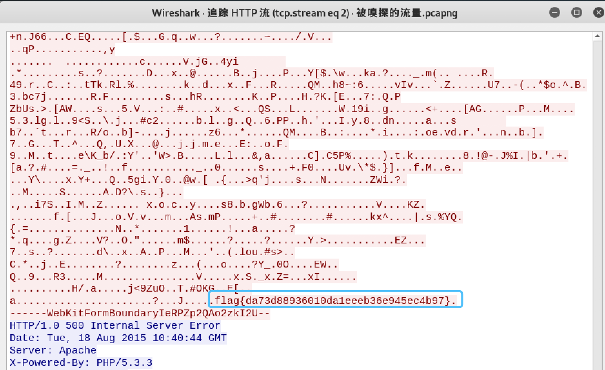

#### 文件中的秘密

- 先使用「binwalk」对文件进行分析。

  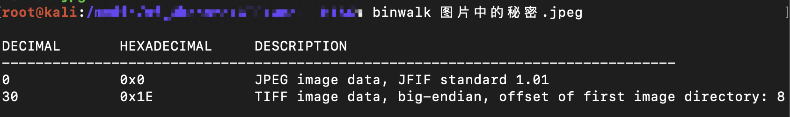

- 在mac下使用「Hex Fiend」打开下载的图片文件。发现图片中有Exif数据。

  

- linux下安装exiftool，查看图片的Exif数据。（kali：`apt-get install exiftool`）

  ```
  root@kali:~# exiftool 图片中的秘密.jpeg
  
  ExifTool Version Number         : 11.16
  File Name                       : 图片中的秘密.jpeg
  Directory                       : .
  File Size                       : 166 kB
  File Modification Date/Time     : 2015:08:19 10:50:50+08:00
  File Access Date/Time           : 2020:10:12 19:08:53+08:00
  File Inode Change Date/Time     : 2020:10:12 19:08:53+08:00
  File Permissions                : rwxrwx---
  File Type                       : JPEG
  File Type Extension             : jpg
  MIME Type                       : image/jpeg
  JFIF Version                    : 1.01
  Resolution Unit                 : inches
  X Resolution                    : 1
  Y Resolution                    : 1
  Exif Byte Order                 : Big-endian (Motorola, MM)
  XP Comment                      : flag{870c5a72806115cb5439345d8b014396}
  Padding                         : (Binary data 1948 bytes, use -b option to extract)
  Image Width                     : 700
  Image Height                    : 1167
  Encoding Process                : Baseline DCT, Huffman coding
  Bits Per Sample                 : 8
  Color Components                : 3
  Y Cb Cr Sub Sampling            : YCbCr4:2:0 (2 2)
  Image Size                      : 700x1167
  Megapixels                      : 0.817
  ```

- 可以找到flag。

#### rar

- linux下解压`.rar`文件。提示需要密码。

  ```bash
  apt-get install rar
  unrar e dianli_jbctf_MISC_T10076_20150707_rar.rar
  ```

- linux下安装rarcrack，暴力破解rar密码。（kali：`apt-get install rarcrack`）

  ```bash
  # rarcrack 文件名 -threads 线程数 -type rar|zip|7z
  rarcrack dianli_jbctf_MISC_T10076_20150707_rar.rar  --threads 4  --type rar
  ```

- 这个方法破解4位密码很慢，参考别人写好的WriteUp，使用工具`ARCHPR`暴力破解，得密码8795。

- 再次解压，输入密码，即得flag。

#### wireshark

- 根据提示：管理员的密码即是答案。打开wireshark，过滤POST包：`http.request.method=="POST"`

  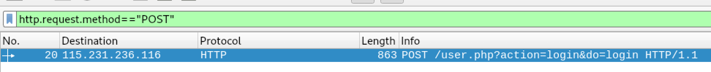

-  查看提交的表单数据。

  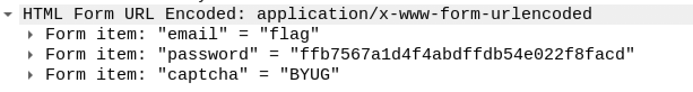

- password即为flag。

#### 乌镇峰会种图

- 先使用「binwalk」对图片进行分析。

  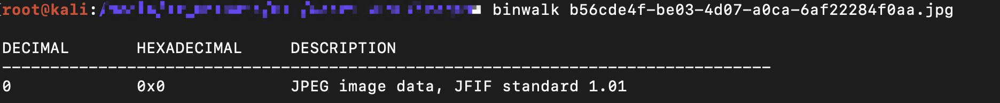

- 发现就是一个JPEG图片。在mac下使用「Hex Fiend」打开下载的图片文件。下滑查找是否含有flag。

  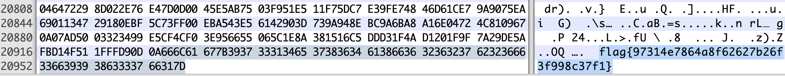

- 下拉到最后即得flag。

#### 你竟然赶我走

- 先使用「binwalk」对图片进行分析。

  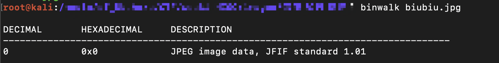

- 发现就是一个JPEG图片。在mac下使用「Hex Fiend」打开下载的图片文件。下滑查找是否含有flag。

  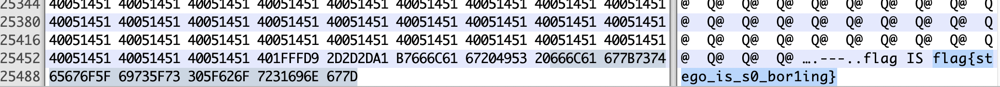

- 下拉到最后即得flag。

#### qr

- 扫一扫二维码即得flag。

#### 流量中的线索

- 先使用「binwalk」对pcap包进行分析。

  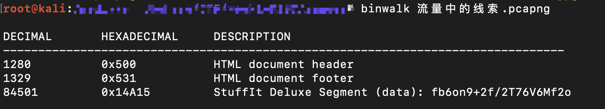

- 使用wireshrak打开.pcap包，过滤http包。

  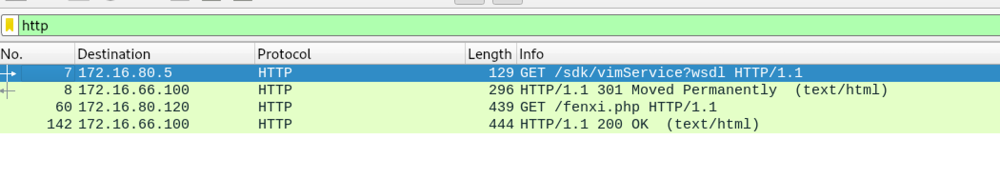

- 右键第三条数据包——>追踪流——>Http流。

  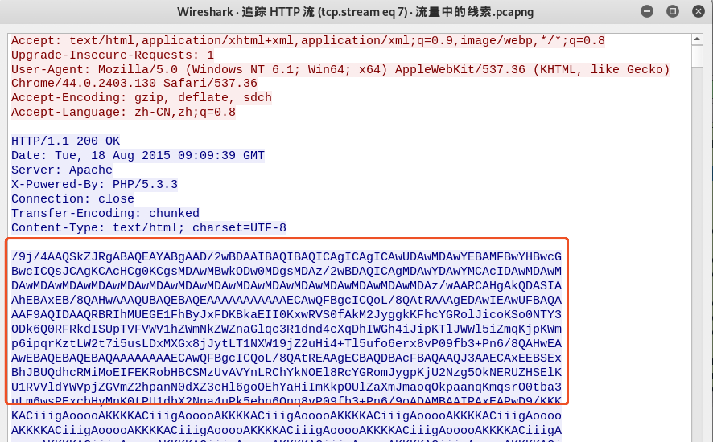

- 红框及以下数据是一段base64编码的数据。将这段数据保存到`1.txt`，解码。

  ```python
  import base64
  f = open("1.txt")
  s = ""
  # 去掉回车
  for line in f:
      s += line.strip("\n")
      
  # base64解码
  imgdata = base64.b64decode(s)
  file = open('1.jpg','wb')
  file.write(imgdata)
  file.close()
  ```

- 打开`1.jpg`，即得flag。

  