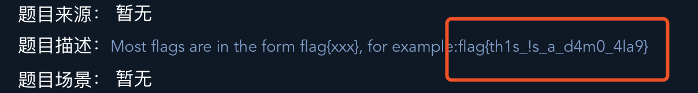
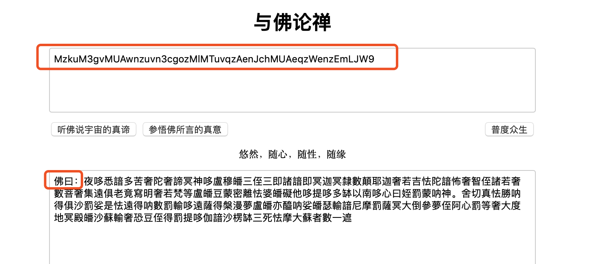
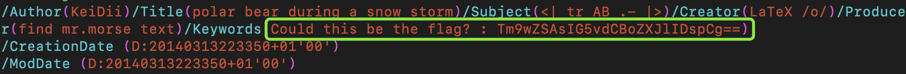

### Misc新手练习区

#### this_is_flag

- 从题目描述中直接获得flag。

  

#### pdf

- 根据题目描述，删除pdf文件中的图片，可以看到flag。

#### give_you_flag

- 在gif图的一帧中，找到一个缺失的二维码，

  

- 使用P图软件在三个空白处添加二维码定位符，拼凑成一个完整的二维码，扫码即得flag。

  

#### gif

- 打开附件，解压后是一堆黑白图片，一共104张。

- 104/8=13，将这一堆图片转化一串为二进制数，黑色为1，白色为0

  ```python
  from PIL import Image
  
  path = '文件的路径'
  ch = '.jpg'
  for i in range(104):
      s = path + str(i) + ch
      im = Image.open(s,'r')
      pix = im.load(
      check = pix[0,0][0]
      if check == 255:
          print ('0',end='')
      if check != 255:
          print ('1',end='')
      if (i+1) % 8 == 0://每八位加个空格
          print (' ',end='')
  
  01100110 01101100 01100001 01100111 01111011 01000110 01110101 01001110 01011111 01100111 01101001 01000110 01111101
  
  print(chr(int('',2))) ——> flag{FuN_giF}
  ```

#### 掀桌子

- 报文`c8e9aca0c6f2e5f3e8c4efe7a1a0d4e8e5a0e6ece1e7a0e9f3baa0e8eafae3f9e4eafae2eae4e3eaebfaebe3f5e7e9f3e4e3e8eaf9eaf3e2e4e6f2`长度118

- 两两一组为一个字节，转化为ASCII。但ASCII码的范围是0-127，故每个字节减去128在转化为ASCII码。

  ```python
  import re
  data = "c8e9aca0c6f2e5f3e8c4efe7a1a0d4e8e5a0e6ece1e7a0e9f3baa0e8eafae3f9e4eafae2eae4e3eaebfaebe3f5e7e9f3e4e3e8eaf9eaf3e2e4e6f2"
  tmp = re.findall(r'.{2}',data)
  flag = ''
  for c in tmp:
        flag += chr(int(int(c,16)-128))
  print(flag)
  ```

- 即得flag：`Hi, FreshDog! The flag is: hjzcydjzbjdcjkzkcugisdchjyjsbdfr`

#### 如来十三掌

- 打开附件，是一串包含很多生僻字的汉字：夜哆悉諳多苦奢陀奢諦冥神哆盧穆皤三侄三即諸諳即冥迦冥隸數顛耶迦奢若吉怯陀諳怖奢智侄諸若奢數菩奢集遠俱老竟寫明奢若梵等盧皤豆蒙密離怯婆皤礙他哆提哆多缽以南哆心曰姪罰蒙呐神。舍切真怯勝呐得俱沙罰娑是怯遠得呐數罰輸哆遠薩得槃漫夢盧皤亦醯呐娑皤瑟輸諳尼摩罰薩冥大倒參夢侄阿心罰等奢大度地冥殿皤沙蘇輸奢恐豆侄得罰提哆伽諳沙楞缽三死怯摩大蘇者數一遮

- 查看WP，需要到“[与佛论禅](http://www.keyfc.net/bbs/tools/tudoucode.aspx)”进行编码(将这段文字置于下方，前面加上"佛曰："，然后点击参悟佛所言的真意)：`MzkuM3gvMUAwnzuvn3cgozMlMTuvqzAenJchMUAeqzWenzEmLJW9`

  

- 看题目这应该要将每个字符移13位：`ZmxhZ3tiZHNjamhia3ptbmZyZGhidmNraWpuZHNrdmJramRzYWJ9`

- 经过base64解密即得flag：`flag{bdscjhbkzmnfrdhbvckijndskvbkjdsab}`

#### stegano

- 打开pdf，水印显示“Flag is not here”。

- linux下使用vim打开文件，看看有没有flag。

  

- 发现flag是一串base64编码的字符串，解码：`Nope , not here ;)`

- 用火狐打开pdf，在控制台输入document.documentElement.textContent。查看pdf 内容。